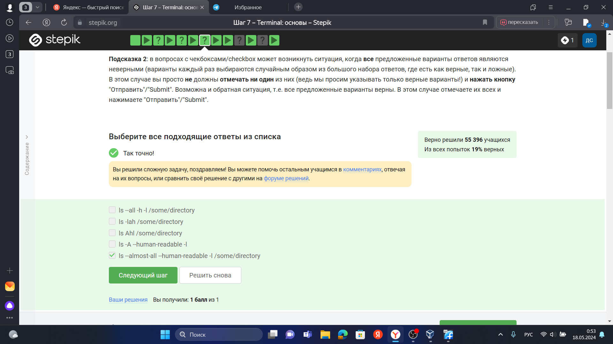
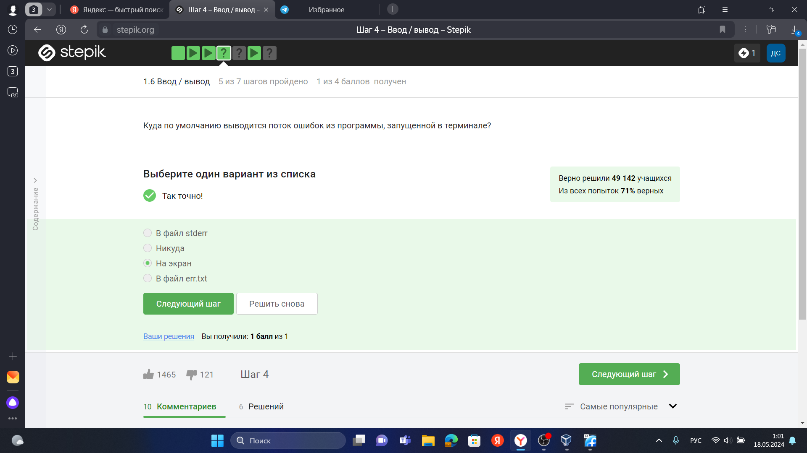

---
## Front matter
title: "Отчет о прохождении 1-ого этапа внешнего курса"
subtitle: Операционные системы 
author: Стрижов Дмитрий Павлович 

## Generic otions
lang: ru-RU
toc-title: "Содержание"

## Bibliography
bibliography: bib/cite.bib
csl: pandoc/csl/gost-r-7-0-5-2008-numeric.csl

## Pdf output format
toc: true # Table of contents
toc-depth: 2
lof: true # List of figures
lot: true # List of tables
fontsize: 12pt
linestretch: 1.5
papersize: a4
documentclass: scrreprt
## I18n polyglossia
polyglossia-lang:
  name: russian
  options:
	- spelling=modern
	- babelshorthands=true
polyglossia-otherlangs:
  name: english
## I18n babel
babel-lang: russian
babel-otherlangs: english
## Fonts
mainfont: PT Serif
romanfont: PT Serif
sansfont: PT Sans
monofont: PT Mono
mainfontoptions: Ligatures=TeX
romanfontoptions: Ligatures=TeX
sansfontoptions: Ligatures=TeX,Scale=MatchLowercase
monofontoptions: Scale=MatchLowercase,Scale=0.9
## Biblatex
biblatex: true
biblio-style: "gost-numeric"
biblatexoptions:
  - parentracker=true
  - backend=biber
  - hyperref=auto
  - language=auto
  - autolang=other*
  - citestyle=gost-numeric
## Pandoc-crossref LaTeX customization
figureTitle: "Рис."
tableTitle: "Таблица"
listingTitle: "Листинг"
lofTitle: "Список иллюстраций"
lotTitle: "Список таблиц"
lolTitle: "Листинги"
## Misc options
indent: true
header-includes:
  - \usepackage{indentfirst}
  - \usepackage{float} # keep figures where there are in the text
  - \floatplacement{figure}{H} # keep figures where there are in the text
---

# Цель работы

Ознакомится с функуционалом ОС Linux.

# Задания

Просмотреть видеокурс и решить тестовые задания

# Решение тестовой части

{#fig:001 width=70%}

Возможно, самое трудное задание курса. Говоря кратко, мы можем увидеть название курса, и он действительно называется "Введение в Linux", как ни странно.

{#fig:002 width=70%}

Чуть выше прочитав критерии курса, выбираем правильные ответы.

{#fig:003 width=70%}

У меня изначально стоит горячо любимая мной Windows, так что именно этот ответ я выбрал.

{#fig:004 width=70%}

На компьютер мы устанавливаем специальную программу, в которой можем создать "компьютер" внутри компьютера, запустив ещё одну ОС виртуально.

{#fig:005 width=70%}

Так как я печатаю этот отчет в вирталке на Федоре, то с гордостью могу сказать, что да!

{#fig:006 width=70%}

При печати сообщения выбираем нужный шрифт, нажимаем save as и выбираем нужный формат файла.

{#fig:007 width=70%}

deb изначально использовался в Debian, но затем также стал использоваться и производных ОС(Ubuntu and etc).

{#fig:008 width=70%}

Заходим на сайт, прописываем необходимые команды, запускаем, проделывыем необходимые действия и видим нужный нам результат.

{#fig:009 width=70%}

Понятное дело, что менеджер обновлений будет заниматься только обновлениями раздличных компонентов ОС.

{#fig:010 width=70%}

Ассоль - героиня литературного произведения, а термин - это определение.

{#fig:011 width=70%}

При написании команд важно учитывать, что терминалом они воспринимаются только в одном виде, это удобно и правильно, потому что разлиные символы в различных варициях могут означать совершенно разные вещи, поэтому верно будет только pwd.

{#fig:012 width=70%}

Интерфейс командной строки явялется регистрозависмым, поэтому не подходит варинт, где A строчная.

{#fig:013 width=70%}

Прописываю полный путь до нужной нам директории, так как в данный момент нахожусь в другой директории.

{#fig:014 width=70%}

rm -r - рекурсивное удаление файлов, удаляется и директория, и файлы внутри неё.

{#fig:015 width=70%}

Проверено опытным путем.

{#fig:016 width=70%}

Это запуск в фоновом режиме.

{#fig:017 width=70%}

{#fig:018 width=70%}

Видно выполнение команды.

{#fig:019 width=70%}

Обычно сообщение об ошибке можно увидеть, так сказать, невооруженным глазов, когда опечатываешься в сотый раз, чтобы сообщения об ошибках вводились в какой-то файл, нужно перенаправить туда их.

{#fig:020 width=70%}

$ programma > file (или programma 1> file) - Перенаправить стандартный поток вывода в файл. Если файл не существует, он будет создан. Если существовал, то будет перезаписан.
$ programma >> file (или programma 1>> file)-Перенаправить стандартный поток вывода в файл. Если файл не существует, он будет создан. Если существует — данные будут дописаны к нему в конец.

{#fig:021 width=70%}

cat new_name.txt | python3 ./interacter.py | less

{#fig:022 width=70%}

Первая команда скачивает файл и даже размещает его, назвав example.jpg, в папке /home/alex/Picture, но после этих манипуляций срабатывает часть ключа -О 1.jpg и размещается в текущей директории, так как не был указатн явный путь.

{#fig:023 width=70%}

-q -quiet Turn off Wget's output.

{#fig:024 width=70%}

При загрузке материалов из Интернета вам часто захочется ограничить поиск только определенными типами файлов. Например, если вы заинтересованы в загрузке GIFфайлов, вы не будете в восторге от получения большого количества документов PostScript, и наоборот.

Wget предлагает два варианта решения этой проблемы. В описании каждого варианта указано короткое имя, длинное имя и эквивалентная команда в .wgetrc.

‘-A acclist’
‘--accept acclist’
‘accept = acclist’
‘--accept-regex urlregex’
‘accept-regex = urlregex’
Аргументом для параметра ‘--accept’ является список файловых суффиксов или шаблонов, которые Wget будет загружать во время рекурсивного поиска. Суффикс является конечной частью файла и состоит из “обычных” букв, например ‘gif’ или ‘.jpg’. Соответствующий шаблон содержит подстановочные знаки, подобные оболочке, например ‘books*’ или ‘zelazny*196[0-9]*’.

Итак, указание ‘wget -A gif,jpg’ заставит Wget загружать только файлы, заканчивающиеся на ‘gif’ или ‘jpg’, т.е. GIF и JPEG. С другой стороны, ‘wget -A "zelazny*196[0-9]*"’ будет загружать только файлы, начинающиеся с ‘zelazny’ и содержащие числа с 1960 по 1969 год в любом месте. Найдите в руководстве вашей оболочки описание того, как работает сопоставление с шаблоном.

Конечно, любое количество суффиксов и шаблонов может быть объединено в список, разделенный запятыми, и приведено в качестве аргумента для ‘-A’.

Аргументом для параметра ‘--accept-regex’ является регулярное выражение, которое сопоставляется с полным URL-адресом

{#fig:025 width=70%}

{#fig:026 width=70%}

gzip - утилита сжатия и восстановления файлов, использующая алгоритм Deflate.

{#fig:027 width=70%}

с - архиватор

j - указатель на тип архиватора bzip

f - потому что создаем архив в файловой системе

{#fig:028 width=70%}

? - один символ

в одном из вариантов была маленькая буква  и неправильный формат.

{#fig:029 width=70%}

{#fig:030 width=70%}

В скринкасте написана програма.

# Выводы

За время прохождения первого этапа внещнего курса я познакомился с ОС Linux и освоил некоторый его функционал.

