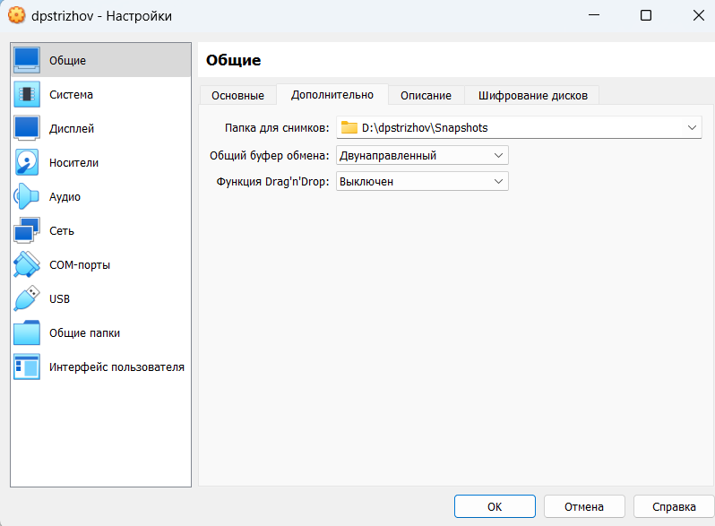

---
## Front matter
lang: ru-RU
title: Отчет по лабораторной работе №1
subtitle: Операционные системы
author:
  - Стрижов Д. П.
institute:
  - Российский университет дружбы народов, Москва, Россия 
date: 02 марта 2024

## i18n babel
babel-lang: russian
babel-otherlangs: english
## Fonts
mainfont: PT Serif
romanfont: PT Serif
sansfont: PT Sans
monofont: PT Mono
mainfontoptions: Ligatures=TeX
romanfontoptions: Ligatures=TeX
sansfontoptions: Ligatures=TeX,Scale=MatchLowercase
monofontoptions: Scale=MatchLowercase,Scale=0.9

## Formatting pdf
toc: false
toc-title: Содержание
slide_level: 2
aspectratio: 169
section-titles: true
theme: metropolis
header-includes:
 - \metroset{progressbar=frametitle,sectionpage=progressbar,numbering=fraction}
 - '\makeatletter'
 - '\beamer@ignorenonframefalse'
 - '\makeatother'
---

## Цель работы

Целью данной работы является приобретение практических навыков установки операционной системы на виртуальную машину, настройки минимально необходимых для дальнейшей работы сервисов.

## Задание

1. Создать виртуальную машину
2. Установить операционную систему
3. После установки
4. Установить драйвера VirtualBox
5. Настроить раскладку клавиатуры
6. Установить имя пользователя и хоста
7. Установка необходимого програмного обеспечения 

# Выполнение лабораторной работы

## Создание виртуальной машины
Заходим в VirtualBox.

{#fig:001 width=70%}

## Создание виртуальной машины

Задаем имя виртуально машины, прикрепляем образ ОС (.

{#fig:002 width=70%}

## Создание виртуальной машины

Указываем нужное количество ОЗУ и ядер процессора .

{#fig:003 width=70%}

## Создание виртуальной машины

Отводи 80 гб памяти для жествого диска.

{#fig:004 width=70%}

## Создание виртуальной машины

Подключаем 3д-ускорение.

{#fig:005 width=70%}

## Создание виртуальной машины

Включаем двунаправленный буфер обмена.

{#fig:006 width=70%}

## Создание виртуальной машины

Подключаем UEFI.

{#fig:007 width=70%}

## Установка операционной системы 

Заходим в ОС.

{#fig:008 width=70%}

## Установка операционной системы 

С помощью комбинации клавиш win+d запускаем поисковик команд и переходим к нашему установщику.

{#fig:009 width=70%}

## Установка операционной системы 

Указываем язык.

{#fig:010 width=70%}

## Установка операционной системы 

Проводим дальнейшие предварительные настройки.

{#fig:011 width=70%}

## Установка операционной системы 

Изымаем оптический диск и перезапускаем виртуальную машину.

{#fig:012 width=70%}

## После установки

Заходим в режим администратора и устанавливаем обновления.

{#fig:013 width=70%}

## После установки

Устанавливаем программы для более удобной работы в консоли.

{#fig:014 width=70%}

## После установки

Отключаем SELinux.

{#fig:015 width=70%}

## Установка драйверов VirtualBox

Заходим в режим мультиплексора и, подключившись в пользователя-администратора, скачиваем средства разработки и пакет dkms.

{#fig:016 width=70%}

## Установка драйверов VirtualBox

{#fig:017 width=70%}

## Установка драйверов VirtualBox

Подключаем образ диска дополнений гостевой ОС.

{#fig:018 width=70%}

## Установка драйверов VirtualBox

Монтируем диск, уставливаем драйвера и перезапускаем систему.

{#fig:019 width=70%}

## Установка драйверов VirtualBox

{#fig:020 width=70%}

## Установка драйверов VirtualBox

{#fig:021 width=70%}

## Настрока раскладки клавиатуры 

Редактируем конфигурационный файл (рис. [-@fig:022]).

{#fig:022 width=70%}

## Настрока раскладки клавиатуры

Редактируем конфигурационный файл для отображения русского языка в будущем и перезапускаем систему.

{#fig:023 width=70%}

## Установка имени пользователя и хоста 

Задаем имя пользователю и пароль.

{#fig:024 width=70%}

## Установка имени пользователя и хоста 

{#fig:025 width=70%}

## Установка имени пользователя и хоста 

Задаем имя хоста и проверяем, все ли мы сделали правильно.

{#fig:026 width=70%}

## Установка имени пользователя и хоста 

{#fig:027 width=70%}

## Установка необходимого програмного обеспечения 

Устанавливаем pandoc.

{#fig:028 width=70%}

## Установка необходимого програмного обеспечения 

Устанавливаем pandoc-crossref.

{#fig:029 width=70%}

## Установка необходимого програмного обеспечения 

{#fig:030 width=70%}

## Установка необходимого програмного обеспечения 

Устанавливаем TeXLive.

{#fig:031 width=70%}

## Домашнее задание 

С помощью команды находим все нужные нам параметры.

{#fig:032 width=70%}

## Домашнее задание 

{#fig:033 width=70%}

## Домашнее задание 

{#fig:034 width=70%}

## Домашнее задание 

{#fig:035 width=70%}

## Выводы
В ходе данной работы я приобрела практические навыкиустановки операционной системы на виртуальную машину, настройки минимально необходимых для дальнейшей работы сервисов.

## Список литературы{.unnumbered}

1. Dash, P. Getting Started with Oracle VM VirtualBox / P. Dash. – Packt Publishing Ltd, 2013. – 86 сс.
2. Colvin, H. VirtualBox: An Ultimate Guide Book on Virtualization with VirtualBox. VirtualBox / H. Colvin. – CreateSpace Independent Publishing Platform, 2015. – 70 сс.
3. Vugt, S. van. Red Hat RHCSA/RHCE 7 cert guide : Red Hat Enterprise Linux 7 (EX200 and EX300) : Certification Guide. Red Hat RHCSA/RHCE 7 cert guide / S. van Vugt. – Pearson IT Certification, 2016. – 1008 сс.
4. Робачевский, А. Операционная система UNIX / А. Робачевский, С. Немнюгин, О. Стесик. – 2-е изд. – Санкт-Петербург : БХВ-Петербург, 2010. – 656 сс.
5. Немет, Э. Unix и Linux: руководство системного администратора. Unix и Linux / Э. Немет, Г. Снайдер, Т.Р. Хейн, Б. Уэйли. – 4-е изд. – Вильямс, 2014. – 1312 сс.
6. Колисниченко, Д.Н. Самоучитель системного администратора Linux : Системный администратор / Д.Н. Колисниченко. – Санкт-Петербург : БХВ-Петербург, 2011. – 544 сс.
7. Robbins, A. Bash Pocket Reference / A. Robbins. – O’Reilly Media, 2016. – 156 сс.

::: {#refs}
:::
