---
## Front matter
title: "Шаблон отчёта по лабораторной работе"
subtitle: "Простейший вариант"
author: "Дмитрий Сергеевич Кулябов"

## Generic otions
lang: ru-RU
toc-title: "Содержание"

## Bibliography
bibliography: bib/cite.bib
csl: pandoc/csl/gost-r-7-0-5-2008-numeric.csl

## Pdf output format
toc: true # Table of contents
toc-depth: 2
lof: true # List of figures
lot: true # List of tables
fontsize: 12pt
linestretch: 1.5
papersize: a4
documentclass: scrreprt
## I18n polyglossia
polyglossia-lang:
  name: russian
  options:
	- spelling=modern
	- babelshorthands=true
polyglossia-otherlangs:
  name: english
## I18n babel
babel-lang: russian
babel-otherlangs: english
## Fonts
mainfont: PT Serif
romanfont: PT Serif
sansfont: PT Sans
monofont: PT Mono
mainfontoptions: Ligatures=TeX
romanfontoptions: Ligatures=TeX
sansfontoptions: Ligatures=TeX,Scale=MatchLowercase
monofontoptions: Scale=MatchLowercase,Scale=0.9
## Biblatex
biblatex: true
biblio-style: "gost-numeric"
biblatexoptions:
  - parentracker=true
  - backend=biber
  - hyperref=auto
  - language=auto
  - autolang=other*
  - citestyle=gost-numeric
## Pandoc-crossref LaTeX customization
figureTitle: "Рис."
tableTitle: "Таблица"
listingTitle: "Листинг"
lofTitle: "Список иллюстраций"
lotTitle: "Список таблиц"
lolTitle: "Листинги"
## Misc options
indent: true
header-includes:
  - \usepackage{indentfirst}
  - \usepackage{float} # keep figures where there are in the text
  - \floatplacement{figure}{H} # keep figures where there are in the text
---

# Цель работы

Целью данной работы является приобретение практических навыков установки операционной системы на виртуальную машину, настройки минимально необходимых для дальнейшей работы сервисов.

# Задание

1. Создать виртуальную машину
2. Установить операционную систему
3. После установки
4. Установить драйвера VirtualBox
5. Настроить раскладку клавиатуры
6. Установить имя пользователя и хоста
7. Установка необзодимого програмного обеспечения 
8. Домашнее задание
9. Контрольные вопросы 

# Выполнение лабораторной работы

## Создание виртуальной машины
Заходим в VirtualBox(рис. [-@fig:001]).

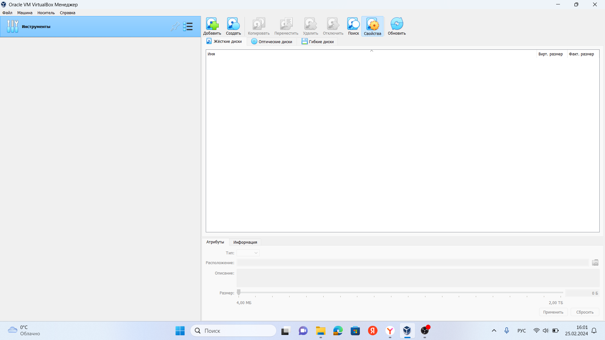{#fig:001 width=70%}

Задаем имя виртуально машины, прикрепляем образ ОС (рис. [-@fig:002]).

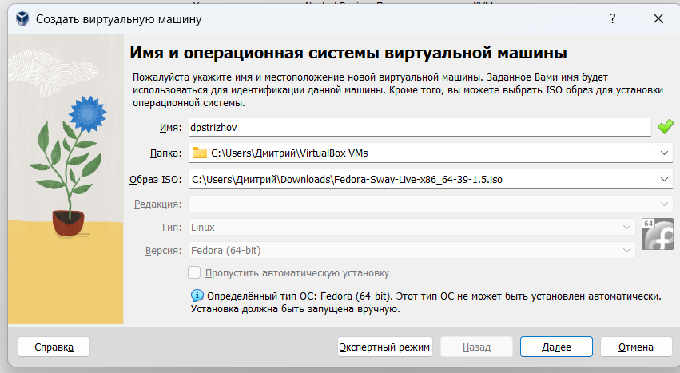{#fig:002 width=70%}

Указываем нужное количество ОЗУ и ядер процессора (рис. [-@fig:003]).

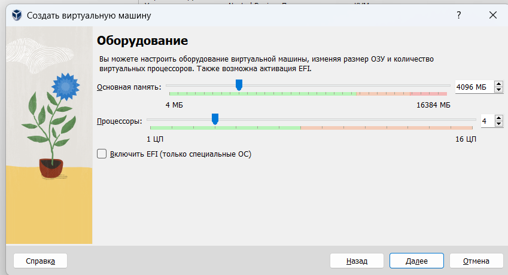{#fig:003 width=70%}

Отводи 80 гб памяти для жествого диска (рис. [-@fig:004]).

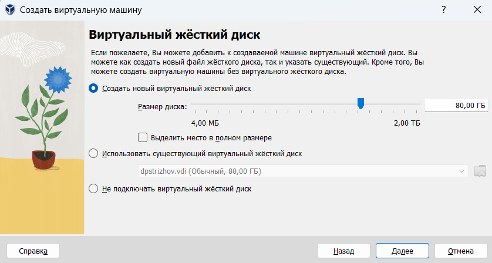{#fig:004 width=70%}

Подключаем 3д-ускорение (рис. [-@fig:005]).

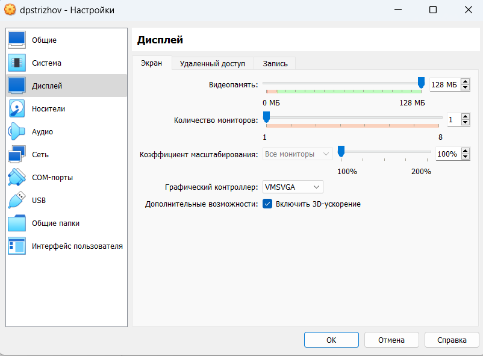{#fig:005 width=70%}

Включаем двунаправленный буфер обмена (рис. [-@fig:006]).

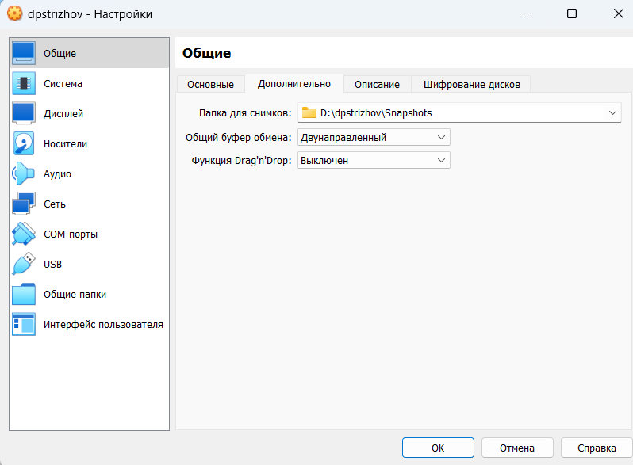{#fig:006 width=70%}

Подключаем UEFI (рис. [-@fig:007]).

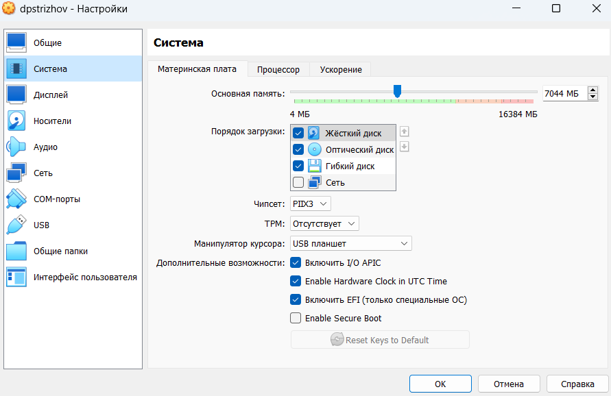{#fig:007 width=70%}

## Установка операционной системы 

Заходим в ОС (рис. [-@fig:008]).

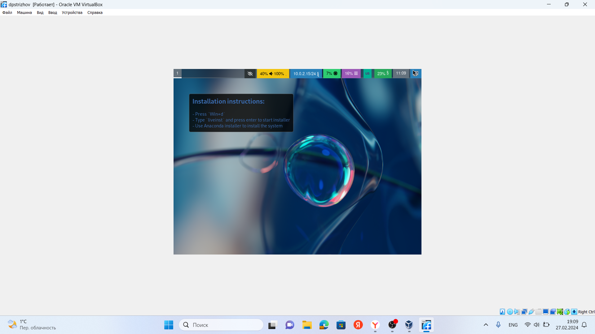{#fig:008 width=70%}

С помощью комбинации клавиш win+d запускаем поисковик команд и переходим к нашему установщику (рис. [-@fig:009]).

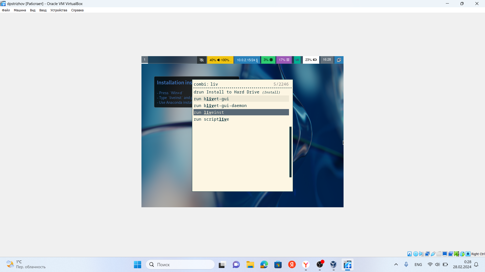{#fig:009 width=70%}

Указываем язык (рис. [-@fig:010]).

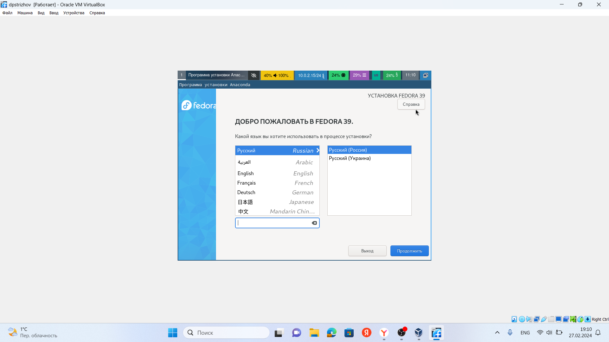{#fig:010 width=70%}

Проводим дальнейшие предварительные настройки (рис. [-@fig:011]).

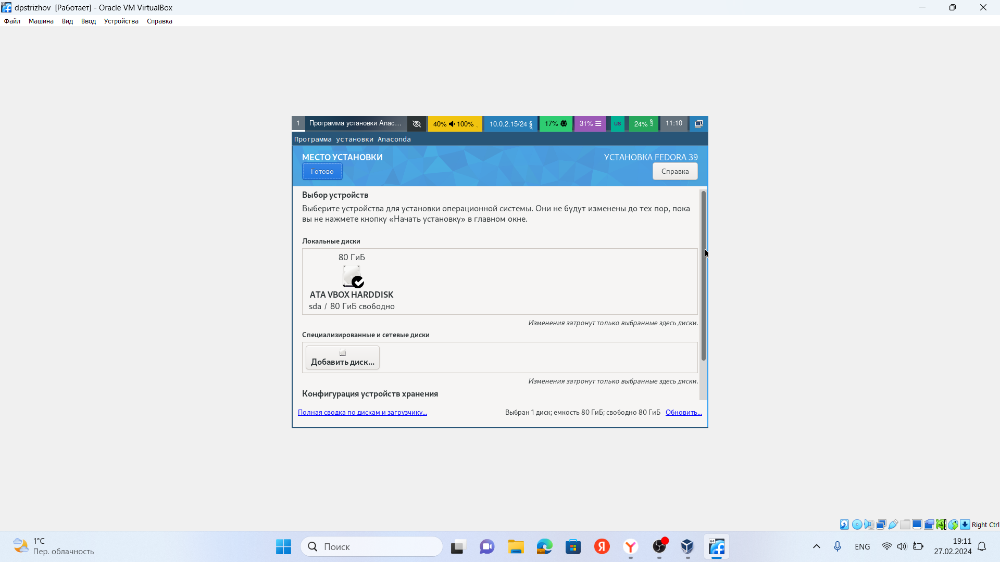{#fig:011 width=70%}

Изымаем оптический диск и перезапускаем виртуальную машину (рис. [-@fig:012]).

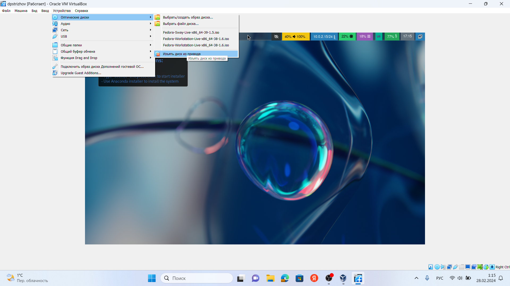{#fig:012 width=70%}

## После установки

Заходим в режим администратора и устанавливаем обновления (рис. [-@fig:013]).

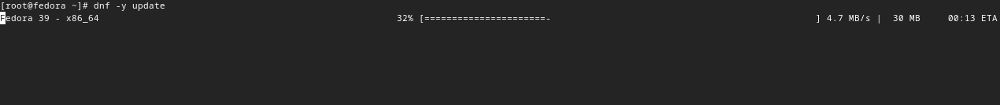{#fig:013 width=70%}

Устанавливаем программы для более удобной работы в консоли (рис. [-@fig:014]).

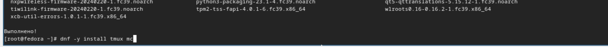{#fig:014 width=70%}

Отключаем SELinux (рис. [-@fig:015]).

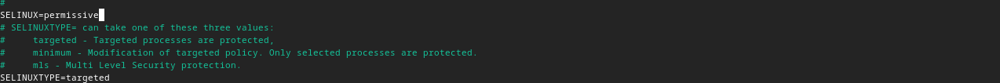{#fig:015 width=70%}

## Установка драйверов VirtualBox

Заходим в режим мультиплексора и, подключившись в пользователя-администратора, скачиваем средства разработки и пакет dkms (рис. [-@fig:016], [-@fig:017]).

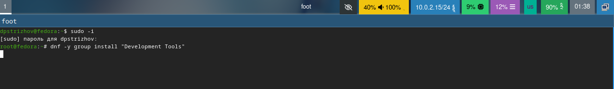{#fig:016 width=70%}

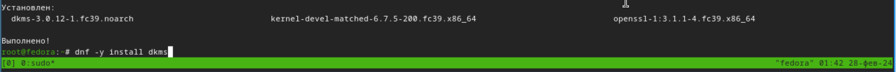{#fig:017 width=70%}

Подключаем образ диска дополнений гостевой ОС (рис. [-@fig:018]).

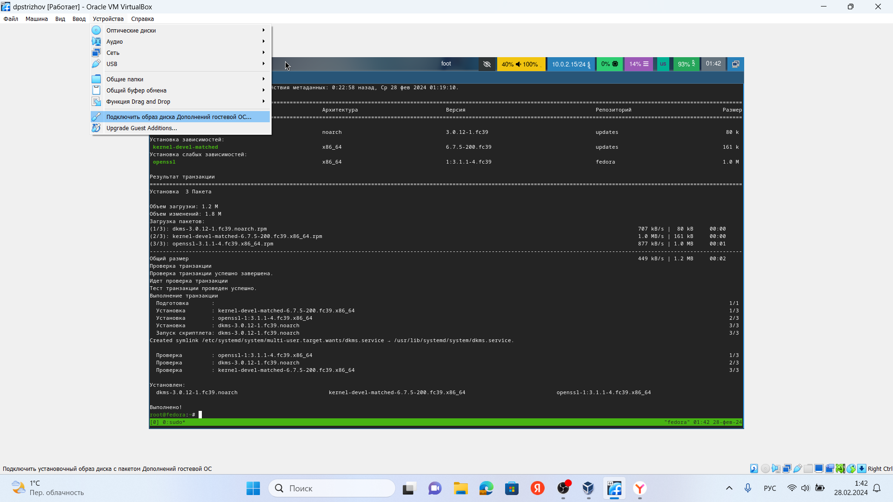{#fig:018 width=70%}

Монтируем диск, уставливаем драйвера и перезапускаем систему (рис. [-@fig:019], [-@fig:020], [-@fig:021]).

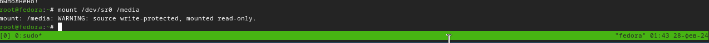{#fig:019 width=70%}

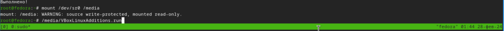{#fig:020 width=70%}

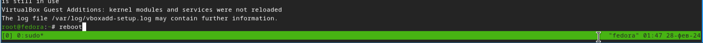{#fig:021 width=70%}

## Настрока раскладки клавиатуры 

Редактируем конфигурационный файл (рис. [-@fig:022]).

{#fig:022 width=70%}

Редактируем конфигурационный файл для отображения русского языка в будущем и перезапускаем систему (рис. [-@fig:023]).

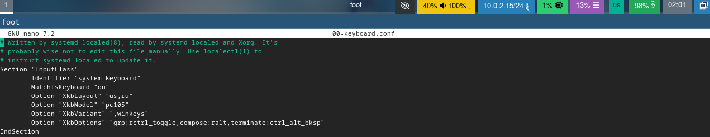{#fig:023 width=70%}

## Установка имени пользователя и хоста 

Задаем имя пользователю и пароль (рис. [-@fig:024], [-@fig:025]).

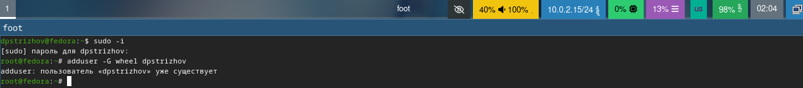{#fig:024 width=70%}

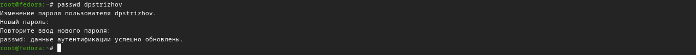{#fig:025 width=70%}

Задаем имя хоста и проверяем, все ли мы сделали правильно (рис. [-@fig:026], [-@fig:027]).

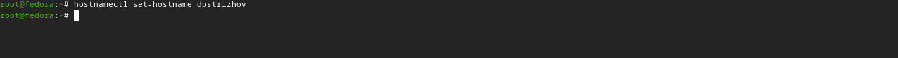{#fig:026 width=70%}

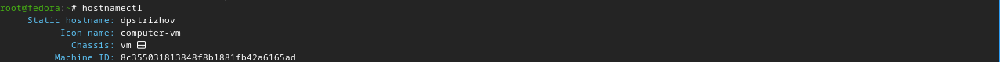{#fig:027 width=70%}

## Установка необходимого програмного обеспечения 

Устанавливаем pandoc (рис. [-@fig:028]).

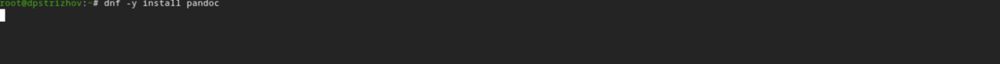{#fig:028 width=70%}

Устанавливаем pandoc-crossref (рис. [-@fig:029], [-@fig:030]).

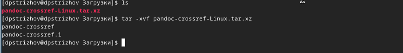{#fig:029 width=70%}

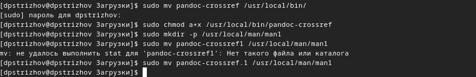{#fig:030 width=70%}

Устанавливаем TeXLive (рис. [-@fig:031]).

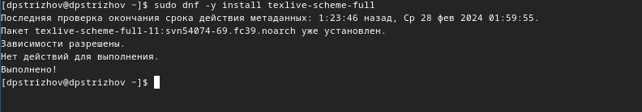{#fig:031 width=70%}

## Домашнее задание 

С помощью команды находим все нужные нам параметры (рис. [-@fig:032], [-@fig:033], [-@fig:034], [-@fig:035]).

{#fig:032 width=70%}

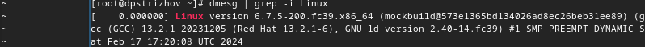{#fig:033 width=70%}

{#fig:034 width=70%}

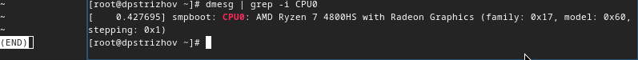{#fig:035 width=70%}

## Контрольные вопросы

1. Какую информацию содержит учётная запись пользователя? - Учётная запись, как правило, содержит сведения, необходимые для опознания пользователя при подключении к системе, сведения для авторизации и учёта

2. Команды терминала:
для получения справки по команде? - man: например, man man выдаст руководство по данной команде

для перемещения по файловой системе? - cd: cd work/study
для просмотра содержимого каталога? - ls: ls work/stydy
для определения объёма каталога? - du: du /work
для создания / удаления каталогов / файлов? - mkdir: mkdir work / rmdir or rm -vr (если каталог не пустой): rmdir work / rm -vr work / rm work
для задания определённых прав на файл / каталог? - chmod o-r month.txt
для просмотра истории команд? - стрелочки вверх вниз или команда history

3. Что такое файловая система? Приведите примеры с краткой характеристикой. - Файловая система - структура, используемая ОС для организации и управления файлами на устройстве хранения. Примеры: FAT - таблица распределения файлов, NTFS - файловая система новой технологии, ReFS - Resilient File System.

4. Как посмотреть, какие файловые системы подмонтированы в ОС? - Для этого есть команда findmnt

5. Как удалить зависший процесс? - Сочетание клавиш Ctrl + C

# Выводы
В ходе данной работы я приобрела практические навыкиустановки операционной системы на виртуальную машину, настройки минимально необходимых для дальнейшей работы сервисов.

# Список литературы{.unnumbered}

1. Dash, P. Getting Started with Oracle VM VirtualBox / P. Dash. – Packt Publishing Ltd, 2013. – 86 сс.
2. Colvin, H. VirtualBox: An Ultimate Guide Book on Virtualization with VirtualBox. VirtualBox / H. Colvin. – CreateSpace Independent Publishing Platform, 2015. – 70 сс.
3. Vugt, S. van. Red Hat RHCSA/RHCE 7 cert guide : Red Hat Enterprise Linux 7 (EX200 and EX300) : Certification Guide. Red Hat RHCSA/RHCE 7 cert guide / S. van Vugt. – Pearson IT Certification, 2016. – 1008 сс.
4. Робачевский, А. Операционная система UNIX / А. Робачевский, С. Немнюгин, О. Стесик. – 2-е изд. – Санкт-Петербург : БХВ-Петербург, 2010. – 656 сс.
5. Немет, Э. Unix и Linux: руководство системного администратора. Unix и Linux / Э. Немет, Г. Снайдер, Т.Р. Хейн, Б. Уэйли. – 4-е изд. – Вильямс, 2014. – 1312 сс.
6. Колисниченко, Д.Н. Самоучитель системного администратора Linux : Системный администратор / Д.Н. Колисниченко. – Санкт-Петербург : БХВ-Петербург, 2011. – 544 сс.
7. Robbins, A. Bash Pocket Reference / A. Robbins. – O’Reilly Media, 2016. – 156 сс.

::: {#refs}
:::
