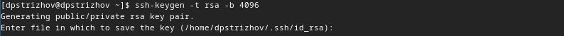
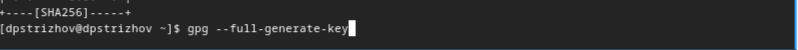
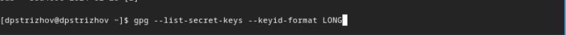
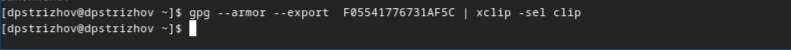
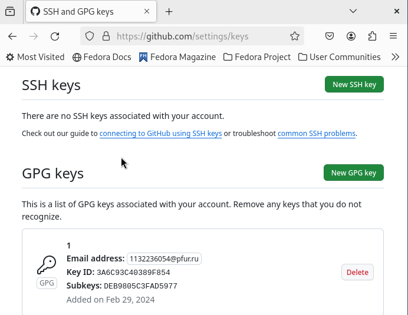
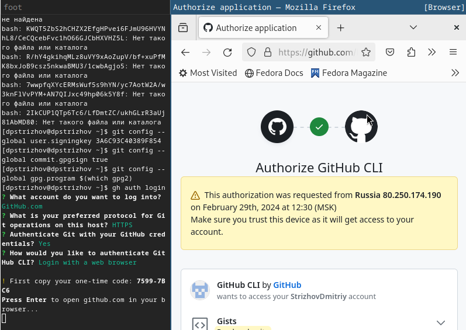
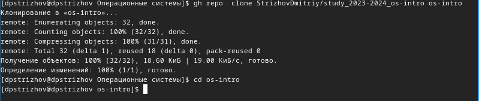
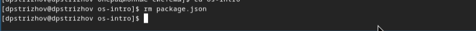
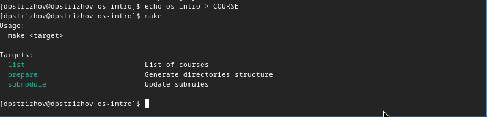
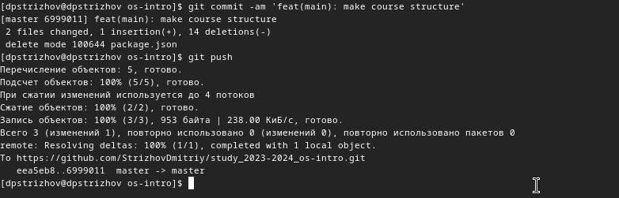

---
## Front matter
lang: ru-RU
title: Отчет по лабораторной работе №2
subtitle: Операционные системы
author:
  - Стрижов Д. П.
institute:
  - Российский университет дружбы народов, Москва, Россия 
date: 02 марта 2024

## i18n babel
babel-lang: russian
babel-otherlangs: english
## Fonts
mainfont: PT Serif
romanfont: PT Serif
sansfont: PT Sans
monofont: PT Mono
mainfontoptions: Ligatures=TeX
romanfontoptions: Ligatures=TeX
sansfontoptions: Ligatures=TeX,Scale=MatchLowercase
monofontoptions: Scale=MatchLowercase,Scale=0.9

## Formatting pdf
toc: false
toc-title: Содержание
slide_level: 2
aspectratio: 169
section-titles: true
theme: metropolis
header-includes:
 - \metroset{progressbar=frametitle,sectionpage=progressbar,numbering=fraction}
 - '\makeatletter'
 - '\beamer@ignorenonframefalse'
 - '\makeatother'
---

## Цель работы

* Изучить идеологию и применение средств контроля версий.
* Освоить умения по работе с git.

## Задание

1. Создать базовую конфигурацию для работы с git.
2. Создать ключ SSH.
3. Создать ключ PGP.
4. Настроить подписи git.
5. Создать локальный каталог для выполнения заданий по предмету.

# Выполнение лабораторной работы

## Создание базовой конфигурации для работы с git

Задаем имя и почту пользователя.

{#fig:001 width=70%}

## Создание базовой конфигурации для работы с git

Настраиваем прочие настройки(utf-8, autocrlf, safecrlf, имя начальной ветки).

{#fig:002 width=70%}

## Создание ключа SSH

Создаем ключ SSH по алгоритмам rsa размером 4096 и ed25519.

{#fig:003 width=70%}

## Создание ключа SSH

{#fig:004 width=70%}

## Создание ключа PGP

Создаем ключ PGP.

{#fig:005 width=70%}

## Создание ключа PGP

Выводи список ключей и копируем отпечаток приватного ключа.

{#fig:006 width=70%}

## Создание ключа PGP

Копируем ключ в буфер обмена.

{#fig:007 width=70%}

## Создание ключа PGP

Добавляем ключ на github.

{#fig:008 width=70%}

## Настройка подписей git
Настраиваем подписи.

{#fig:009 width=70%}

## Создание локального каталога для выполнения заданий по предмету

Заходим в github.

{#fig:010 width=70%}

## Создание локального каталога для выполнения заданий по предмету

Создаем шаблон для рабочего пространства.

{#fig:011 width=70%}

## Создание локального каталога для выполнения заданий по предмету

{#fig:012 width=70%}

## Создание локального каталога для выполнения заданий по предмету

{#fig:013 width=70%}

## Создание локального каталога для выполнения заданий по предмету

Удаляем ненужные файлы.

{#fig:014 width=70%}

## Создание локального каталога для выполнения заданий по предмету

Создаем необходимые катологи.

{#fig:015 width=70%}

## Создание локального каталога для выполнения заданий по предмету

Отправляем на github.

{#fig:016 width=70%}

## Выводы

За время выполнения лабораторной работы я изучил идеологию и применение средств контроля версий, а также освоил умения по работе git.

## Список литературы{.unnumbered}

Введение в Git: настройка и основные команды. Ссылка: https://selectel.ru/blog/tutorials/git-setup-and-common-commands/
