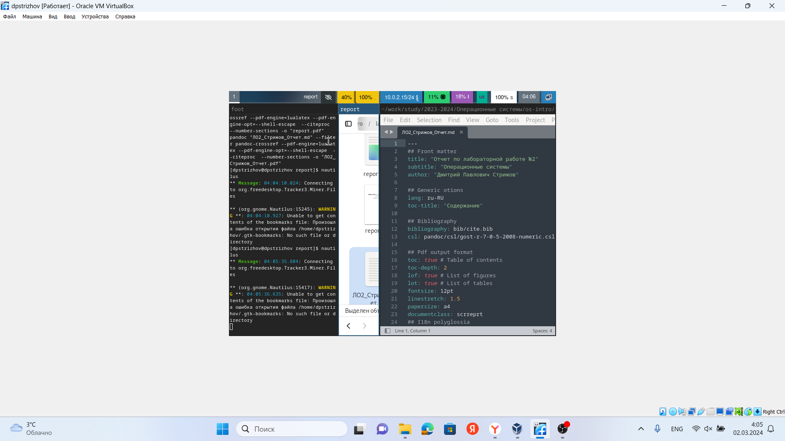
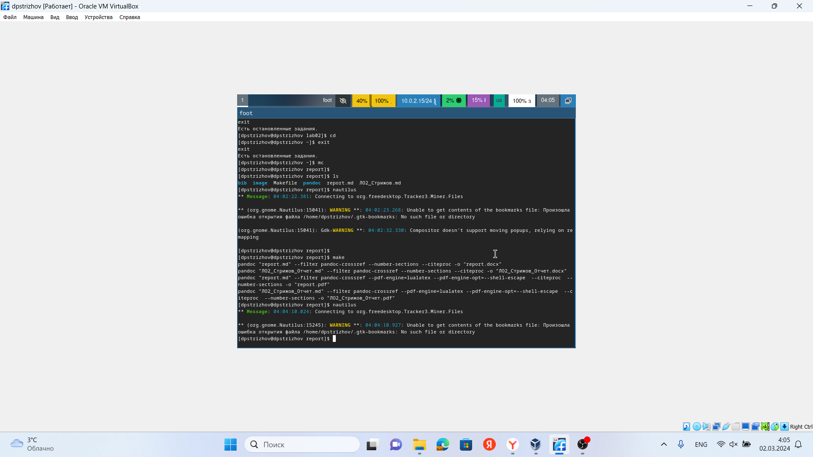
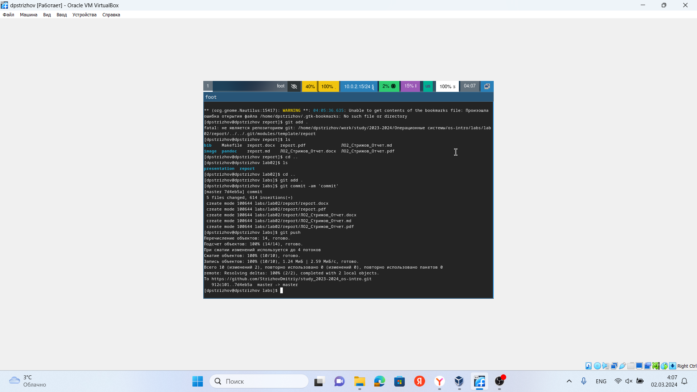

---
## Front matter
lang: ru-RU
title: Отчет по лабораторной работе №3
subtitle: Операционные системы
author:
  - Стрижов Д. П.
institute:
  - Российский университет дружбы народов, Москва, Россия 
date: 02 марта 2024

## i18n babel
babel-lang: russian
babel-otherlangs: english
## Fonts
mainfont: PT Serif
romanfont: PT Serif
sansfont: PT Sans
monofont: PT Mono
mainfontoptions: Ligatures=TeX
romanfontoptions: Ligatures=TeX
sansfontoptions: Ligatures=TeX,Scale=MatchLowercase
monofontoptions: Scale=MatchLowercase,Scale=0.9

## Formatting pdf
toc: false
toc-title: Содержание
slide_level: 2
aspectratio: 169
section-titles: true
theme: metropolis
header-includes:
 - \metroset{progressbar=frametitle,sectionpage=progressbar,numbering=fraction}
 - '\makeatletter'
 - '\beamer@ignorenonframefalse'
 - '\makeatother'
---

## Цель работы

Научиться выполнять отчеты с помощью легковесного языка разметки Markdown. 

## Задание

1. Сделайте отчёт по предыдущей лабораторной работе в формате Markdown.
2. В качестве отчёта просьба предоставить отчёты в 3 форматах: pdf, docx и md (в архиве,
поскольку он должен содержать скриншоты, Makefile и т.д.)

## Выполнение лабораторной работы

Создаю отчет.

{#fig:001 width=70%}

## Выполнение лабораторной работы

Конвертирую его в необходимые форматы.

{#fig:002 width=70%}

## Выполнение лабораторной работы

Отправляю на github.

{#fig:003 width=70%}

# Выводы

За время выполнения лабораторной работы я научился делать отчеты в Markdown. 

# Список литературы{.unnumbered}

Что такое Markdown и как им пользоваться. URL: https://lifehacker.ru/chto-takoe-markdown/