---
## Front matter
lang: ru-RU
title: Отчет по лабораторной работе №4
subtitle: Операционные системы
author:
  - Стрижов Д. П.
institute:
  - Российский университет дружбы народов, Москва, Россия
date: 09 марта 2024

## i18n babel
babel-lang: russian
babel-otherlangs: english
## Fonts
mainfont: PT Serif
romanfont: PT Serif
sansfont: PT Sans
monofont: PT Mono
mainfontoptions: Ligatures=TeX
romanfontoptions: Ligatures=TeX
sansfontoptions: Ligatures=TeX,Scale=MatchLowercase
monofontoptions: Scale=MatchLowercase,Scale=0.9

## Formatting pdf
toc: false
toc-title: Содержание
slide_level: 2
aspectratio: 169
section-titles: true
theme: metropolis
header-includes:
 - \metroset{progressbar=frametitle,sectionpage=progressbar,numbering=fraction}
 - '\makeatletter'
 - '\beamer@ignorenonframefalse'
 - '\makeatother'
---

## Цель и задачи
Цель:
Получение навыков правильной работы с репозиториями git.

Задачи:
1. Выполнить работу для тестового репозитория.
2. Преобразовать рабочий репозиторий в репозиторий с git-flow и conventional commits.

# Выполнение лабораторной работы

## Устанавливаем gitflow 

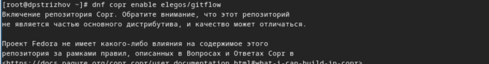{#fig:001 width=70%}

## Устанавливаем gitflow 

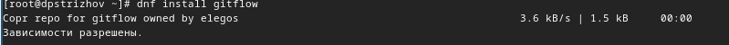{#fig:002 width=70%}

## Устанавливаем nodejs 

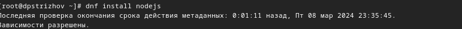{#fig:003 width=70%}

## Устанавливаем nodejs 

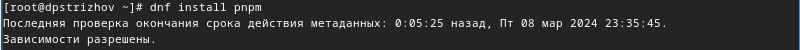{#fig:004 width=70%}

## Запускаем pnpm

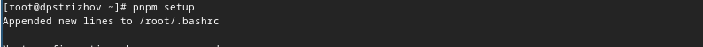{#fig:005 width=70%}

## Перелогинимся с помощью команды source,а затем добавляем программу для помощи в формировании коммитов  

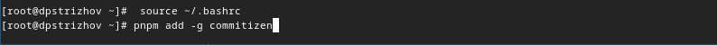{#fig:006 width=70%}

## Добавляем программу для помощи в создании логов

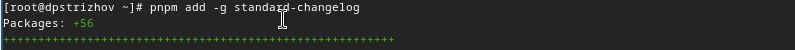{#fig:007 width=70%}

## Создаем новый репозиторий на github,делаем первый коммит и выкладываем его на github

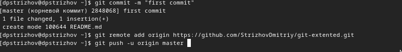{#fig:008 width=70%}

## Конфигурация для пакетов Node.js 

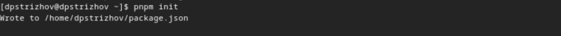{#fig:009 width=70%}

## Изменяем конфигурации под наши нужды

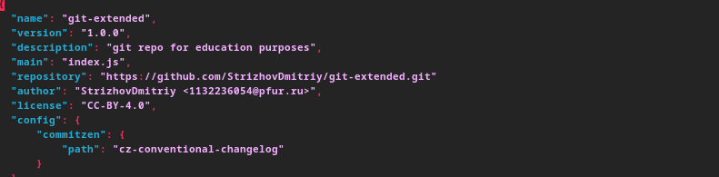{#fig:010 width=70%}

## Отправляем файлы на github

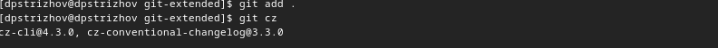{#fig:011 width=70%}

## Отправляем файлы на github

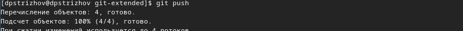{#fig:012 width=70%}

## Инициализируем git-flow

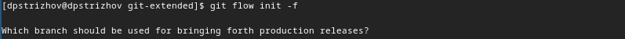{#fig:013 width=70%}

## Проверяем ветку, на которой мы находимся

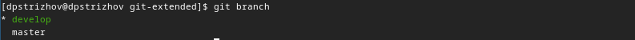{#fig:014 width=70%}

## Загружаем весь репозиторий

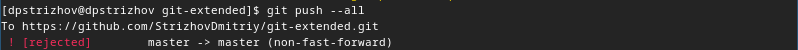{#fig:015 width=70%}

## Создаем релиз версии 1.0.0

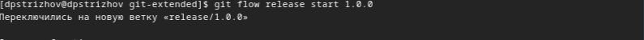{#fig:016 width=70%}

## Создаем журнал изменений

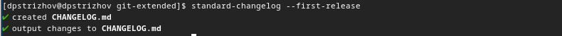{#fig:017 width=70%}

## Добавляем журнал изменений в индекс

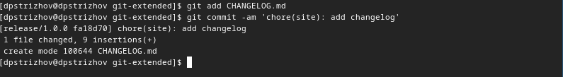{#fig:018 width=70%}

## Отправим данные и создадим релиз

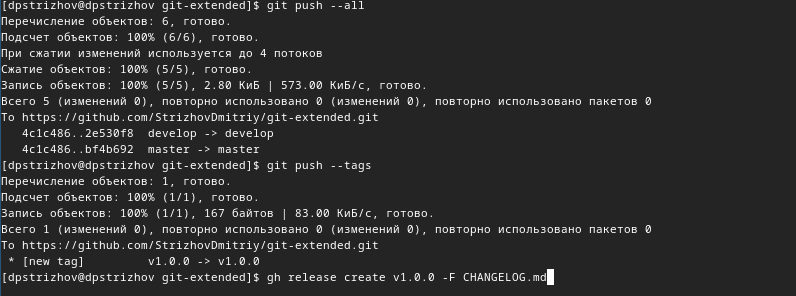{#fig:019 width=70%}

## Создаем ветку для новой функциональности и объединеняем данную ветку с develop

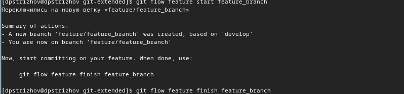{#fig:020 width=70%}

## Создаем релиз версии 1.2.3.

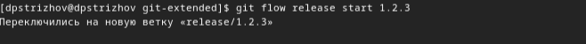{#fig:021 width=70%}

## Создаем журнал изменений.

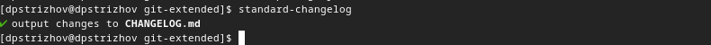{#fig:022 width=70%}

## Добавляем журнал изменений в индекс и заливаем релизную ветку в основную.

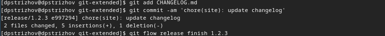{#fig:023 width=70%}

## Отправляем данные на github.

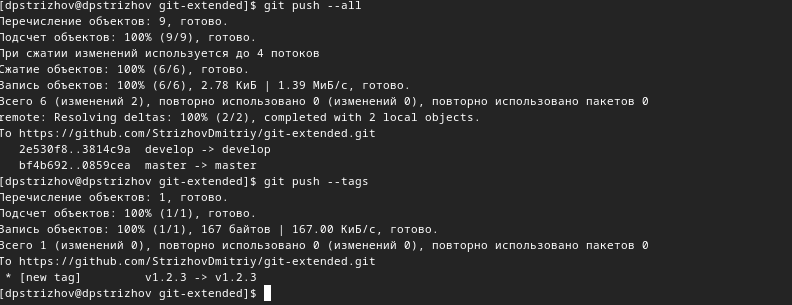{#fig:024 width=70%}

## Создаем релиз версии 1.2.3.

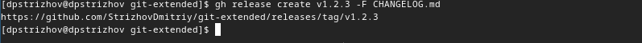{#fig:025 width=70%}

## Выводы

В процессе выполнения данной лабораторной работы я научился правильной работе с репозиториями git. 

## Список литературы{.unnumbered}
Лабораторная работа №4: https://esystem.rudn.ru/mod/page/view.php?id=1098794
::: {#refs}
:::

