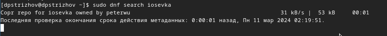

---
## Front matter
lang: ru-RU
title: Отче по лабораторной работе №5
subtitle: Операционные системы
author:
  - Стрижов Д. П.
institute:
  - Российский университет дружбы народов, Москва, Россия
date: 11 марта 2024

## i18n babel
babel-lang: russian
babel-otherlangs: english

## Fonts
mainfont: PT Serif
romanfont: PT Serif
sansfont: PT Sans
monofont: PT Mono
mainfontoptions: Ligatures=TeX
romanfontoptions: Ligatures=TeX
sansfontoptions: Ligatures=TeX,Scale=MatchLowercase
monofontoptions: Scale=MatchLowercase,Scale=0.9

## Formatting pdf
toc: false
toc-title: Содержание
slide_level: 2
aspectratio: 169
section-titles: true
theme: metropolis
header-includes:
 - \metroset{progressbar=frametitle,sectionpage=progressbar,numbering=fraction}
 - '\makeatletter'
 - '\beamer@ignorenonframefalse'
 - '\makeatother'
---

## Цели и задачи

Цель: Настройка рабочей среды.

Задачи:

1. Менеджер паролей pass
2. Управление файлами конфигурации 

# Выполнение лабораторной работы

## Устанавливаем необходимые программы 

{#fig:001 width=70%}

## Устанавливаем необходимые программы 

{#fig:002 width=70%}

## Проверяем список ключей

{#fig:003 width=70%}

## Инициализируем хранилище 

{#fig:004 width=70%}

## Создадим структуру git 

{#fig:005 width=70%}

## Задаем адрес репозитория на хостинге 

{#fig:006 width=70%}

## Синхронизируем 

{#fig:007 width=70%}

## Проверяем статус синхронизации 

{#fig:008 width=70%}

## Устанавливаем плагин browserpass 

{#fig:009 width=70%}

## Создаем новый пароль, а потом выводим его, а затем генерируем новый 

{#fig:010 width=70%}

## Устанавливаем дополнительное програмное обеспечение 

{#fig:011 width=70%}

## Устанавливаем шрифты 

{#fig:012 width=70%}

## Устанавливаем шрифты 

{#fig:013 width=70%}

## Устанавливаем шрифты 

{#fig:014 width=70%}

## Устанавливаем бинарный файл

{#fig:015 width=70%}

## Создаем собственный репозиторий с помозью утилит 

{#fig:016 width=70%}

## Проводим инициализацию и проверяем изменения 

{#fig:017 width=70%}

## Вносим изменения 

{#fig:018 width=70%}

## Извлекаем из репозитория изменений 

{#fig:019 width=70%}

## Подключение автоматического вненсения изменений 

{#fig:020 width=70%}

## Выводы

За время выполнения лабораторной работы я настроил рабочую систему.

## Список литературы{.unnumbered}

Лабораторная работа №5: https://esystem.rudn.ru/mod/page/view.php?id=1098796