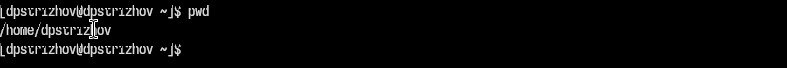
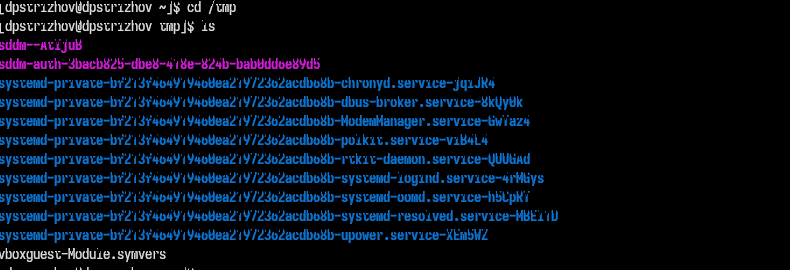
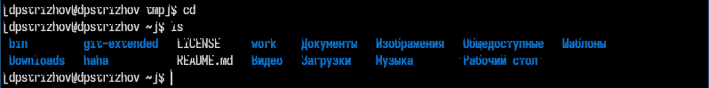
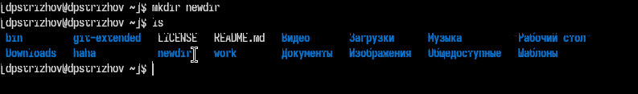
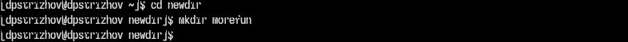
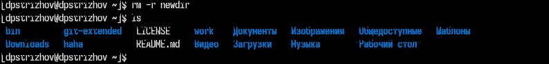
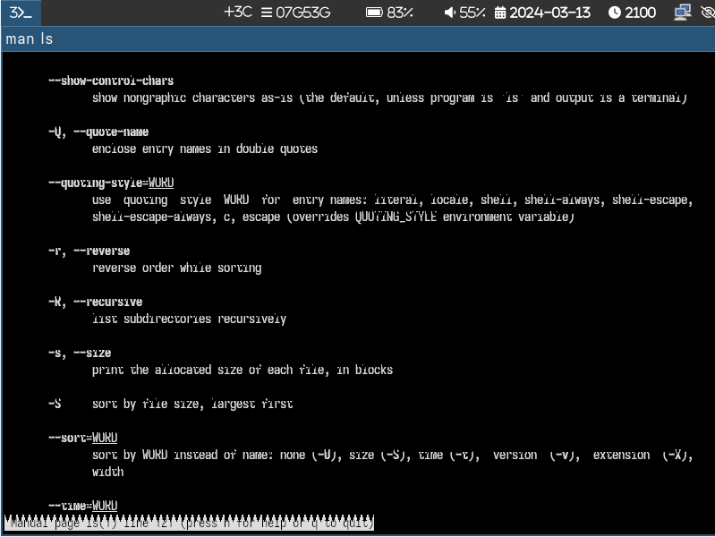
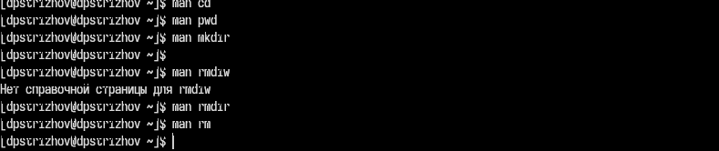
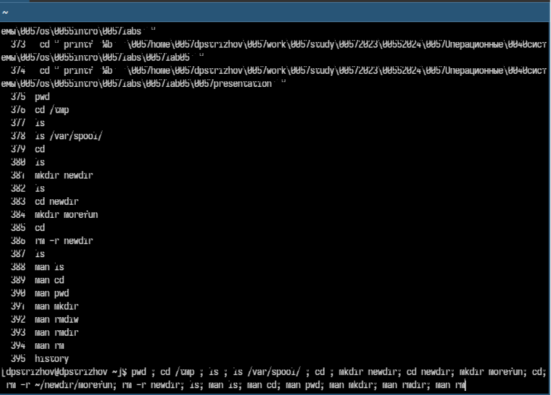

---
## Front matter
lang: ru-RU
title: Отчет по лабораторной работе №6
subtitle: Операционные ситемы
author:
  - Стрижов Д. П.
institute:
  - Российский университет дружбы народов, Москва, Россия
date: 13 марта 2024

## I18n babel
babel-lang: russian
babel-otherlangs: english
## Fonts
mainfont: PT Serif
romanfont: PT Serif
sansfont: PT Sans
monofont: PT Mono
mainfontoptions: Ligatures=TeX
romanfontoptions: Ligatures=TeX
sansfontoptions: Ligatures=TeX,Scale=MatchLowercase
monofontoptions: Scale=MatchLowercase,Scale=0.9

## Formatting pdf
toc: false
toc-title: Содержание
slide_level: 2
aspectratio: 169
section-titles: true
theme: metropolis
header-includes:
 - \metroset{progressbar=frametitle,sectionpage=progressbar,numbering=fraction}
 - '\makeatletter'
 - '\beamer@ignorenonframefalse'
 - '\makeatother'
---
## Цель работы

Приобретение практических навыков взаимодействия пользователя с системой по-
средством командной строки.

# Выполнение лабораторной работы

## Определяем полное имя пользователя

{#fig:001 width=70%}

## Переходим в каталог /tmp и выводим его содержимое 

{#fig:002 width=70%}

## Проверяем наличие в каталоге /var/spool/ подкаталога cron 

{#fig:003 width=70%}

## Переходим в домашний каталог 

{#fig:004 width=70%}

## Создаем каталог newdir

{#fig:005 width=70%}

## Создаем каталог morefun 

{#fig:006 width=70%}

## Удаляем newdir 

{#fig:007 width=70%}

## Для вывода не только каталога, но и подкаталога нужно использовать ls с ключом R, а для вывода с сортировкой по времени изменения файлов используеться ключ -t 

{#fig:008 width=70%}

## ОСновные команды 

cd - команда для перемещения по каталогам. pwd - команда для поиска полного пути до директории, в которой мы находимся. mkdir - команда для создания директории, p - онсовной ключ, позваляющий создавать подкаталоги внутри каталога. rmdir - команда для удаления ТОЛЬКО директорий. rm - команда для удаления и дерикторий, и файлов, r - ключ, позвалющий удалять рекурсивно каталоги и файлы в нем.

{#fig:009 width=70%}

## Используем команду и выполняем все команды, которые использовались во время выполнения лабораторной работы, прописав их в одну строку 

{#fig:010 width=70%}

## Выводы

За время выполнения лабораторной работы я приобрел практические навыки работы с командной строкой.

## Список литературы{.unnumbered}

Лабораторная работа №6: https://esystem.rudn.ru/course/view.php?id=113
::: {#refs}
:::
