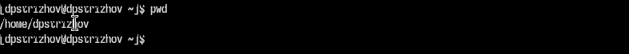
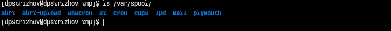
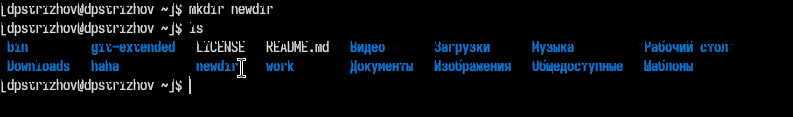
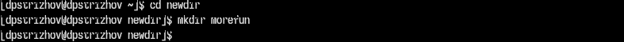

---
## Front matter
title: "Отчет по лабораторной работе №6"
subtitle: "Операционные системы"
author: "Дмитрий Павлович Стрижов"

## Generic otions
lang: ru-RU
toc-title: "Содержание"

## Bibliography
bibliography: bib/cite.bib
csl: pandoc/csl/gost-r-7-0-5-2008-numeric.csl

## Pdf output format
toc: true # Table of contents
toc-depth: 2
lof: true # List of figures
lot: true # List of tables
fontsize: 12pt
linestretch: 1.5
papersize: a4
documentclass: scrreprt
## I18n polyglossia
polyglossia-lang:
  name: russian
  options:
	- spelling=modern
	- babelshorthands=true
polyglossia-otherlangs:
  name: english
## I18n babel
babel-lang: russian
babel-otherlangs: english
## Fonts
mainfont: PT Serif
romanfont: PT Serif
sansfont: PT Sans
monofont: PT Mono
mainfontoptions: Ligatures=TeX
romanfontoptions: Ligatures=TeX
sansfontoptions: Ligatures=TeX,Scale=MatchLowercase
monofontoptions: Scale=MatchLowercase,Scale=0.9
## Biblatex
biblatex: true
biblio-style: "gost-numeric"
biblatexoptions:
  - parentracker=true
  - backend=biber
  - hyperref=auto
  - language=auto
  - autolang=other*
  - citestyle=gost-numeric
## Pandoc-crossref LaTeX customization
figureTitle: "Рис."
listingTitle: "Листинг"
lolTitle: "Листинги"
## Misc options
indent: true
header-includes:
  - \usepackage{indentfirst}
  - \usepackage{float} # keep figures where there are in the text
  - \floatplacement{figure}{H} # keep figures where there are in the text
---

# Цель работы

Приобретение практических навыков взаимодействия пользователя с системой по-
средством командной строки.

# Задание

1. Определите полное имя вашего домашнего каталога. Далее относительно этого ката-
лога будут выполняться последующие упражнения.
2. Выполните следующие действия:
2.1. Перейдите в каталог /tmp.
2.2. Выведите на экран содержимое каталога /tmp. Для этого используйте команду ls
с различными опциями. Поясните разницу в выводимой на экран информации.
2.3. Определите, есть ли в каталоге /var/spool подкаталог с именем cron?
2.4. Перейдите в Ваш домашний каталог и выведите на экран его содержимое. Опре-
делите, кто является владельцем файлов и подкаталогов?
3. Выполните следующие действия:
3.1. В домашнем каталоге создайте новый каталог с именем newdir.
3.2. В каталоге ~/newdir создайте новый каталог с именем morefun.
3.3. В домашнем каталоге создайте одной командой три новых каталога с именами
letters, memos, misk. Затем удалите эти каталоги одной командой.
3.4. Попробуйте удалить ранее созданный каталог ~/newdir командой rm. Проверьте,
был ли каталог удалён.
3.5. Удалите каталог ~/newdir/morefun из домашнего каталога. Проверьте, был ли
каталог удалён.
4. С помощью команды man определите, какую опцию команды ls нужно использо-
вать для просмотра содержимое не только указанного каталога, но и подкаталогов,
входящих в него.
5. С помощью команды man определите набор опций команды ls, позволяющий отсорти-
ровать по времени последнего изменения выводимый список содержимого каталога
с развёрнутым описанием файлов.
6. Используйте команду man для просмотра описания следующих команд: cd, pwd, mkdir,
rmdir, rm. Поясните основные опции этих команд.
7. Используя информацию, полученную при помощи команды history, выполните мо-
дификацию и исполнение нескольких команд из буфера команд

# Теоретическое введение

В операционной системе типа Linux взаимодействие пользователя с системой обычно
осуществляется с помощью командной строки посредством построчного ввода ко-
манд. При этом обычно используется командные интерпретаторы языка shell: /bin/sh;
/bin/csh; /bin/ksh.
Формат команды. Командой в операционной системе называется записанный по
специальным правилам текст (возможно с аргументами), представляющий собой ука-
зание на выполнение какой-либо функций (или действий) в операционной системе.
Обычно первым словом идёт имя команды, остальной текст — аргументы или опции,
конкретизирующие действие.
Общий формат команд можно представить следующим образом:
<имя_команды><разделитель><аргументы>
Команда man. Команда man используется для просмотра (оперативная помощь) в диа-
логовом режиме руководства (manual) по основным командам операционной системы
типа Linux.
Формат команды:
man <команда>
Пример (вывод информации о команде man):
1 man man
Для управления просмотром результата выполнения команды man можно использовать
следующие клавиши:
– Space — перемещение по документу на одну страницу вперёд;
– Enter — перемещение по документу на одну строку вперёд;
– q — выход из режима просмотра описания.
Команда cd. Команда cd используется для перемещения по файловой системе опера-
ционной системы типа Linux.
Замечание 1. Файловая система ОС типа Linux — иерархическая система каталогов,
подкаталогов и файлов, которые обычно организованы и сгруппированы по функ-
циональному признаку. Самый верхний каталог в иерархии называется корневым
и обозначается символом /. Корневой каталог содержит системные файлы и другие
каталоги.
Формат команды:
cd [путь_к_каталогу]
Кулябов Д. С. и др. Операционные системы 39
Для перехода в домашний каталог пользователя следует использовать команду cd без
параметров или cd ~.
Например, команда
1 cd /afs/dk.sci.pfu.edu.ru/home
позволяет перейти в каталог /afs/dk.sci.pfu.edu.ru/home (если такой существует),
а для того, чтобы подняться выше на одну директорию, следует использовать:
1 cd ..
Подробнее об опциях команды cd смотри в справке с помощью команды man:
1 man cd
Команда pwd. Для определения абсолютного пути к текущему каталогу используется
команда pwd (print working directory).
Пример (абсолютное имя текущего каталога пользователя dharma):
1 pwd
результат:
1 /afs/dk.sci.pfu.edu.ru/home/d/h/dharma
2
Сокращения имён файлов. В работе с командами, в качестве аргументов которых
выступает путь к какому-либо каталогу или файлу, можно использовать сокращённую
запись пути. Символы сокращения приведены в табл. 4.1.
Таблица 4.1
Символы сокращения имён файлов
Символ Значение
~ Домашний каталог
. Текущий каталог
.. Родительский каталог
Например, в команде cd для перемещения по файловой системе сокращённую за-
пись пути можно использовать следующим образом (команды чередуются с выводом
результата выполнения команды pwd):
1 pwd
2
3 /afs/dk.sci.pfu.edu.ru/home/d/h/dharma
4
40 Лабораторная работа № 4. Основы интерфейса взаимодействия пользователя с системой …
5 cd ..
6 pwd
7
8 /afs/dk.sci.pfu.edu.ru/home/d/h
9
10 cd ../..
11 pwd
12
13 /afs/dk.sci.pfu.edu.ru/home
14
15 cd ~/work
16 pwd
17
18 /afs/dk.sci.pfu.edu.ru/home/d/h/dharma/work
Команда ls. Команда ls используется для просмотра содержимого каталога.
Формат команды:
ls [-опции] [путь]
Пример:
1 cd
2 cd ..
3 pwd
4
5 /afs/dk.sci.pfu.edu.ru/home/d/h
6
7 ls
8
9 dharma
Некоторые файлы в операционной системе скрыты от просмотра и обычно исполь-
зуются для настройки рабочей среды. Имена таких файлов начинаются с точки. Для
того, чтобы отобразить имена скрытых файлов, необходимо использовать команду ls
с опцией a:
1 ls -a
Можно также получить информацию о типах файлов (каталог, исполняемый файл,
ссылка), для чего используется опция F. При использовании этой опции в поле имени
выводится символ, который определяет тип файла (см. табл. 4.2)
Таблица 4.2
Символ, который определяет тип файла
Тип файла Символ
Каталог /
Исполняемый файл *
Ссылка @
Кулябов Д. С. и др. Операционные системы 41
Чтобы вывести на экран подробную информацию о файлах и каталогах, необходимо
использовать опцию l. При этом о каждом файле и каталоге будет выведена следующая
информация:
– тип файла,
– право доступа,
– число ссылок,
– владелец,
– размер,
– дата последней ревизии,
– имя файла или каталога.
Пример:
1 cd /
2 ls
Результат:
1 bin boot dev etc home lib media mnt
2 opt proc root sbin sys tmp usr var
В этом же каталоге команда
1 ls -alF
даст примерно следующий результат:
1 drwxr-xr-x 21 root root 4096 Jan. 17 09:00 ./
2 drwxr-xr-x 21 root root 4096 Jan. 17 09:00 ../
3 drwxr-xr-x 2 root root 4096 Jan. 18 15:57 bin/
4 drwxr-xr-x 2 root root 4096 Apr. 14 2008 boot/
5 drwxr-xr-x 20 root root 14120 Feb. 17 10:48 dev/
6 drwxr-xr-x 170 root root 12288 Feb. 17 09:19 etc/
7 drwxr-xr-x 6 root root 4096 Aug. 5 2009 home/
8 lrwxrwxrwx 1 root root 5 Jan. 12 22:01 lib -> lib64/
9 drwxr-xr-x 8 root root 4096 Jan. 30 21:41 media/
10 drwxr-xr-x 5 root root 4096 Jan. 17 2010 mnt/
11 drwxr-xr-x 25 root root 4096 Jan. 16 09:55 opt/
12 dr-xr-xr-x 163 root root 0 Feb. 17 13:17 proc/
13 drwxr-xr-x 31 root root 4096 Feb. 15 23:57 root/
14 drwxr-xr-x 2 root root 12288 Jan. 18 15:57 sbin/
15 drwxr-xr-x 12 root root 0 Feb. 17 13:17 sys/
16 drwxrwxrwt 12 root root 500 Feb. 17 16:35 tmp/
17 drwxr-xr-x 22 root root 4096 Jan. 18 09:26 usr/
18 drwxr-xr-x 17 root root 4096 Jan. 14 17:38 var/
Команда mkdir. Команда mkdir используется для создания каталогов.
Формат команды:
mkdir имя_каталога1 [имя_каталога2...]
Пример создания каталога в текущем каталоге:
42 Лабораторная работа № 4. Основы интерфейса взаимодействия пользователя с системой …
1 cd
2 pwd
3
4 /afs/dk.sci.pfu.edu.ru/home/d/h/dharma
5
6 ls
7
8 Desktop public tmp
9 GNUstep public_html work
10
11 mkdir abc
12 ls
13
14 abc GNUstep public_html work
15 Desktop public tmp
Замечание 2. Для того чтобы создать каталог в определённом месте файловой системы,
должны быть правильно установлены права доступа.
Можно создать также подкаталог в существующем подкаталоге:
1 mkdir parentdir
2 mkdir parentdir/dir
При задании нескольких аргументов создаётся несколько каталогов:
1 cd parentdir
2 mkdir dir1 dir2 dir3
Можно использовать группировку:
1 mkdir parentdir/{dir1,dir2,dir3}
Если же требуется создать подкаталог в каталоге, отличном от текущего, то путь к нему
требуется указать в явном виде:
1 mkdir ../dir1/dir2
или
1 mkdir ~/dir1/dir2
Интересны следующие опции:
--mode (или -m) — установка атрибутов доступа;
--parents (или -p) — создание каталога вместе с родительскими по отношению к нему
каталогами.
Атрибуты задаются в численной или символьной нотации:
1 mkdir --mode=777 dir
Кулябов Д. С. и др. Операционные системы 43
или
1 mkdir -m a+rwx dir
Опция --parents (краткая форма -p) позволяет создавать иерархическую цепочку
подкаталогов, создавая все промежуточные каталоги:
1 mkdir -p ~/dir1/dir2/dir3
Команда rm. Команда rm используется для удаления файлов и/или каталогов.
Формат команды:
rm [-опции] [файл]
Если требуется, чтобы выдавался запрос подтверждения на удаление файла, то необхо-
димо использовать опцию i.
Чтобы удалить каталог, содержащий файлы, нужно использовать опцию r. Без указания
этой опции команда не будет выполняться.
Пример:
1 cd
2 mkdir abs
3 rm abc
4
5 rm: abc is a directory
6
7 rm -r abc
Если каталог пуст, то можно воспользоваться командой rmdir. Если удаляемый
каталог содержит файлы, то команда не будет выполнена — нужно использовать rm -
r имя_каталога.
Команда history. Для вывода на экран списка ранее выполненных команд исполь-
зуется команда history. Выводимые на экран команды в списке нумеруются. К любой
команде из выведенного на экран списка можно обратиться по её номеру в списке,
воспользовавшись конструкцией !<номер_команды>.
Пример:
1 history
2 1 pwd
3 2 ls
4 3 ls -a
5 4 ls -l
6 5 cd /
7 6 history
8
9 !5
10 cd /
Можно модифицировать команду из выведенного на экран списка при помощи следу-
ющей конструкции:
44 Лабораторная работа № 4. Основы интерфейса взаимодействия пользователя с системой …
!<номер_команды>:s/<что_меняем>/<на_что_меняем>
Пример:
1 !3:s/a/F
2 ls -F
Замечание 3. Если в заданном контексте встречаются специальные символы (типа «.»,
«/», «*» и т.д.), надо перед ними поставить символ экранирования \ (обратный слэш).
Использование символа «;». Если требуется выполнить последовательно несколько
команд, записанный в одной строке, то для этого используется символ точка с запятой
Пример:
1 cd; ls

# Выполнение лабораторной работы

Определяем полное имя пользователя (рис. [-@fig:001]).

{#fig:001 width=70%}

Переходим в каталог /tmp и выводим его содержимое (рис. [-@fig:002]).

{#fig:002 width=70%}

Проверяем наличие в каталоге /var/spool/ подкаталога cron (рис. [-@fig:003]).

{#fig:003 width=70%}

Переходим в домашний каталог (рис. [-@fig:004]).

{#fig:004 width=70%}

Создаем каталог newdir (рис. [-@fig:005]).

{#fig:005 width=70%}

Создаем каталог morefun (рис. [-@fig:006]).

{#fig:006 width=70%}

Удаляем newdir (рис. [-@fig:007]).

{#fig:007 width=70%}

Для вывода не только каталога, но и подкаталога нужно использовать ls с ключом R, а для вывода с сортировкой по времени изменения файлов используеться ключ -t (рис. [-@fig:008]).

{#fig:008 width=70%}

cd - команда для перемещения по каталогам. pwd - команда для поиска полного пути до директории, в которой мы находимся. mkdir - команда для создания директории, p - онсовной ключ, позваляющий создавать подкаталоги внутри каталога. rmdir - команда для удаления ТОЛЬКО директорий. rm - команда для удаления и дерикторий, и файлов, r - ключ, позвалющий удалять рекурсивно каталоги и файлы в нем (рис. [-@fig:009]).

{#fig:009 width=70%}

Используем команду и выполняем все команды, которые использовались во время выполнения лабораторной работы, прописав их в одну строку (рис. [-@fig:010]).

{#fig:010 width=70%}

# Выводы

За время выполнения лабораторной работы я приобрел практические навыки работы с командной строкой.

# Список литературы{.unnumbered}

Лабораторная работа №6: https://esystem.rudn.ru/course/view.php?id=113
::: {#refs}
:::
