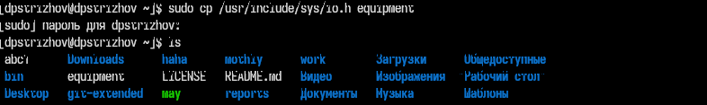
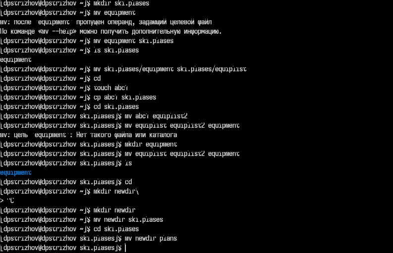
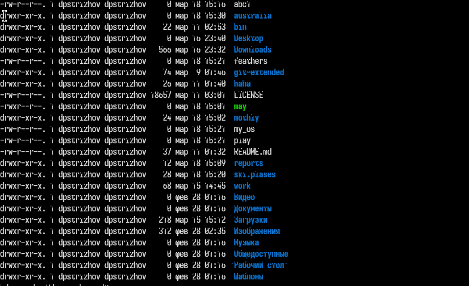
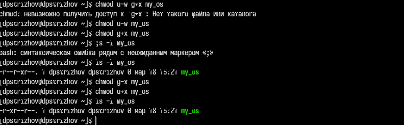
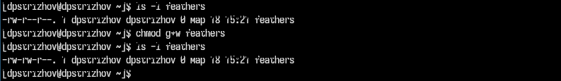
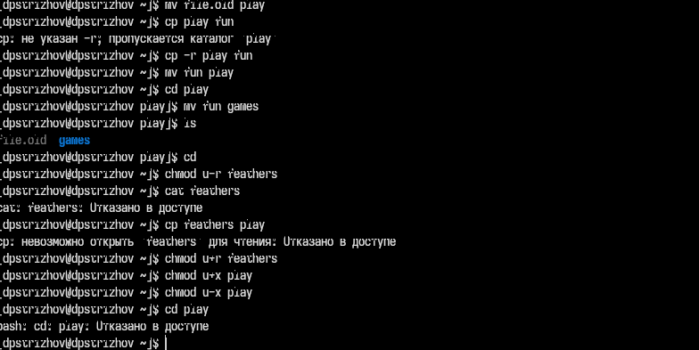

---
## Front matter
lang: ru-RU
title: Отчет по лабараторной работе №7
subtitle: Операционные системы
author:
  - Стрижов Д. П.
institute:
  - Российский университет дружбы народов, Москва, Россия
date: 23 марта 2024

## i18n babel
babel-lang: russian
babel-otherlangs: english
## Fonts
mainfont: PT Serif
romanfont: PT Serif
sansfont: PT Sans
monofont: PT Mono
mainfontoptions: Ligatures=TeX
romanfontoptions: Ligatures=TeX
sansfontoptions: Ligatures=TeX,Scale=MatchLowercase
monofontoptions: Scale=MatchLowercase,Scale=0.9
## Formatting pdf
toc: false
toc-title: Содержание
slide_level: 2
aspectratio: 169
section-titles: true
theme: metropolis
header-includes:
 - \metroset{progressbar=frametitle,sectionpage=progressbar,numbering=fraction}
 - '\makeatletter'
 - '\beamer@ignorenonframefalse'
 - '\makeatother'
---

## Цель работы

Ознакомление с файловой системой Linux, её структурой, именами и содержанием
каталогов. Приобретение практических навыков по применению команд для работы
с файлами и каталогами, по управлению процессами (и работами), по проверке исполь-
зования диска и обслуживанию файловой системы.

## Задание

2. Выполните следующие действия, зафиксировав в отчёте по лабораторной работе
используемые при этом команды и результаты их выполнения:
2.1.  Скопируйте файл /usr/include/sys/io.h в домашний каталог и назовите его
equipment. Если файла io.h нет, то используйте любой другой файл в каталоге
/usr/include/sys/ вместо него.
2.2. В домашнем каталоге создайте директорию ~/ski.plases.
2.3. Переместите файл equipment в каталог ~/ski.plases.
2.4. Переименуйте файл ~/ski.plases/equipment в ~/ski.plases/equiplist.
2.5. Создайте в домашнем каталоге файл abc1 и скопируйте его в каталог
~/ski.plases, назовите его equiplist2.
2.6. Создайте каталог с именем equipment в каталоге ~/ski.plases.
2.7. Переместите файлы ~/ski.plases/equiplist и equiplist2 в каталог
~/ski.plases/equipment.
2.8. Создайте и переместите каталог ~/newdir в каталог ~/ski.plases и назовите
его plans.
Кулябов Д. С. и др. Операционные системы 53
3. Определите опции команды chmod, необходимые для того, чтобы присвоить перечис-
ленным ниже файлам выделенные права доступа, считая, что в начале таких прав
нет:
3.1. drwxr--r-- ... australia
3.2. drwx--x--x ... play
3.3. -r-xr--r-- ... my_os
3.4. -rw-rw-r-- ... feathers
При необходимости создайте нужные файлы.
4. Проделайте приведённые ниже упражнения, записывая в отчёт по лабораторной
работе используемые при этом команды:
4.1. Просмотрите содержимое файла /etc/password.
4.2. Скопируйте файл ~/feathers в файл ~/file.old.
4.3. Переместите файл ~/file.old в каталог ~/play.
4.4. Скопируйте каталог ~/play в каталог ~/fun.
4.5. Переместите каталог ~/fun в каталог ~/play и назовите его games.
4.6. Лишите владельца файла ~/feathers права на чтение.
4.7. Что произойдёт, если вы попытаетесь просмотреть файл ~/feathers командой
cat?
4.8. Что произойдёт, если вы попытаетесь скопировать файл ~/feathers?
4.9. Дайте владельцу файла ~/feathers право на чтение.
4.10. Лишите владельца каталога ~/play права на выполнение.
4.11. Перейдите в каталог ~/play. Что произошло?
4.12. Дайте владельцу каталога ~/play право на выполнение.
5. Прочитайте man по командам mount, fsck, mkfs, kill и кратко их охарактеризуйте,
приведя примеры. 

# Выполнение лабораторной работы

## Копируем из /usr/include/sys файл io.h и переименовываем его в equipment 

{#fig:001 width=70%}

## Работа с копированием и перемещением файлов

Создаем репозиторий ski.plases, затем перенесем файл equipment в этот репозиторий, переименуем этот файл в equiplist, затем создадим в домашнем каталоге файл abc1, скопируем его в каталог и переименуем этот файл в equiplist2, перенесем оба переименованых файла в каталог equipment. Создадим в домашнем каталоге репозиторий newdir, перенесем его в ski.plases и переименуем в plans 

## Работа с копированием и перемещением файлов

{#fig:002 width=70%}

## Видим, что у каталога australia есть все необходимые разрешения 

{#fig:003 width=70%}

## Настраиваем все необходимые разрешения у my_os 

{#fig:004 width=70%}

## Настраиваем разрешения для feathers

{#fig:005 width=70%}

## Явные примеры работы с разрешением файлов

Переносим файл file.old в репозиторий play, копируем репозиторий play в каталог fun, затем переименовываем его в games. Запрещаем пользователю чтение feathers, пробуем вывести то, что находится в этом файле, получаем отказ в доступе, потому что убрали разрешение для владельца файла возможность его читать, по этой же причине мы не можем скопировать этот файл. Убираем разрешение у каталога play на выполнение, затем пытаемся перейти в этот каталог, но безуспешно, так как у нас нет разрешения на выполнения какого-либо действия 

## Явные примеры работы с разрешением файлов

{#fig:006 width=70%}

## Выводы

За время выполнения лабараторной работы я ознакомился полностью с файловой структорой Linux.

## Список литературы

Лабараторная работа №7: https://esystem.rudn.ru/course/view.php?id=113

