---
## Front matter
lang: ru-RU
title: Отчет по лабараторной работе №8
subtitle: Операционные системы
author:
  - Стрижов Д. П.
institute:
  - Российский университет дружбы народов, Москва, Россия
date: 01 января 1970

## i18n babel
babel-lang: russian
babel-otherlangs: english
## Fonts
mainfont: PT Serif
romanfont: PT Serif
sansfont: PT Sans
monofont: PT Mono
mainfontoptions: Ligatures=TeX
romanfontoptions: Ligatures=TeX
sansfontoptions: Ligatures=TeX,Scale=MatchLowercase
monofontoptions: Scale=MatchLowercase,Scale=0.9
## Formatting pdf
toc: false
toc-title: Содержание
slide_level: 2
aspectratio: 169
section-titles: true
theme: metropolis
header-includes:
 - \metroset{progressbar=frametitle,sectionpage=progressbar,numbering=fraction}
 - '\makeatletter'
 - '\beamer@ignorenonframefalse'
 - '\makeatother'
---

## Цель работы

Ознакомление с инструментами поиска файлов и фильтрации текстовых данных.
Приобретение практических навыков: по управлению процессами (и заданиями), по
проверке использования диска и обслуживанию файловых систем.

## Задание

1. Осуществите вход в систему, используя соответствующее имя пользователя.
2. Запишите в файл file.txt названия файлов, содержащихся в каталоге /etc. Допи-
шите в этот же файл названия файлов, содержащихся в вашем домашнем каталоге.
3. Выведите имена всех файлов из file.txt, имеющих расширение .conf, после чего
запишите их в новый текстовой файл conf.txt.
Кулябов Д. С. и др. Операционные системы 59
4. Определите, какие файлы в вашем домашнем каталоге имеют имена, начинавшиеся
с символа c? Предложите несколько вариантов, как это сделать.
5. Выведите на экран (по странично) имена файлов из каталога /etc, начинающиеся
с символа h.
6. Запустите в фоновом режиме процесс, который будет записывать в файл ~/logfile
файлы, имена которых начинаются с log.
7. Удалите файл ~/logfile.
8. Запустите из консоли в фоновом режиме редактор gedit.
9. Определите идентификатор процесса gedit, используя команду ps, конвейер и фильтр
grep. Как ещё можно определить идентификатор процесса?
10. Прочтите справку (man) команды kill, после чего используйте её для завершения
процесса gedit.
11. Выполните команды df и du, предварительно получив более подробную информацию
об этих командах, с помощью команды man.
12. Воспользовавшись справкой команды find, выведите имена всех директорий, имею-
щихся в вашем домашнем каталоге. 

# Выполнение лабораторной работы

## Добавляем в файл file.txt названия всех файлов каталога /etc, а затем дописываем в этот файл названия файлов в домашнем каталоге 

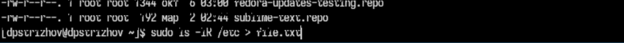{#fig:001 width=70%}

## Добавляем в файл file.txt названия всех файлов каталога /etc, а затем дописываем в этот файл названия файлов в домашнем каталоге 

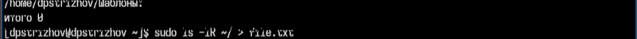{#fig:002 width=70%}

## Записываем все файлы из file.txt с conf в названии в файл conf.txt 

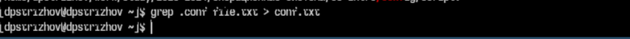{#fig:003 width=70%}

## Выводим все файлы домашнего каталога, у которых есть "с" в названии

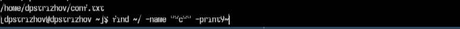{#fig:004 width=70%}

## Выводим все файлы домашнего каталога, у которых есть "с" в названии

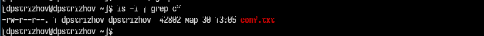{#fig:005 width=70%}

## Выводим все файлы каталога с h в названии 

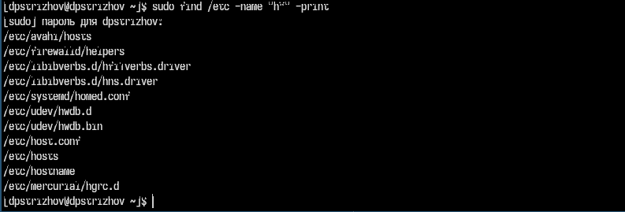{#fig:006 width=70%}

## Записываем в фоновом режиме в файл logfile все файлы домашнего каталога, содержищие в названии log 

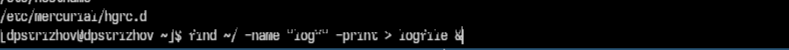{#fig:007 width=70%}

## Удаляем полученный ранее файл 

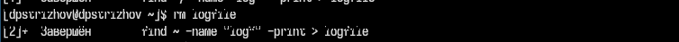{#fig:008 width=70%}

## Запускаем текстовый редактор в фоновом режиме 

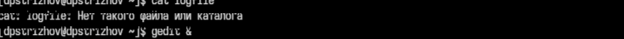{#fig:009 width=70%}

## Определяем идентификатор процесса, запущенного ранее 

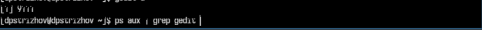{#fig:010 width=70%}

## Узнаем больше о команде kill и прерываем процесс gedit с помощью идентификатора 

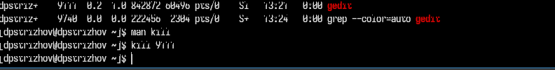{#fig:011 width=70%}

## Узнаем больше о командах df, du и выполняем их 

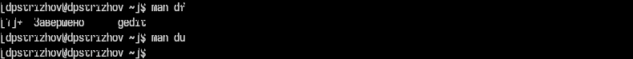{#fig:012 width=70%}

## Узнаем больше о командах df, du и выполняем их 

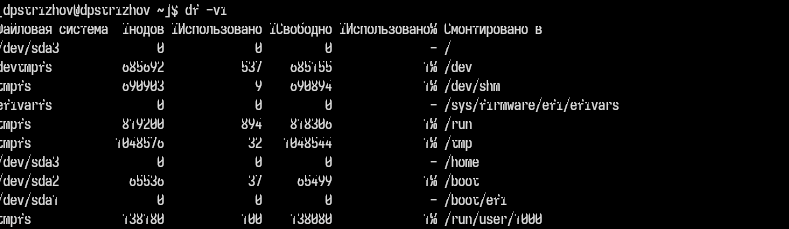{#fig:013 width=70%}

## Узнаем больше о командах df, du и выполняем их 

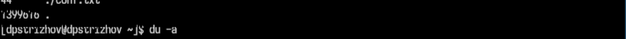{#fig:014 width=70%}

## С помощью man узнаем как, используя find, вывести каталоги домашнего каталога 

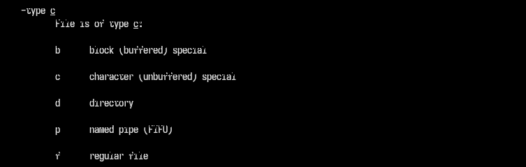{#fig:015 width=70%}

## С помощью man узнаем как, используя find, вывести каталоги домашнего каталога 

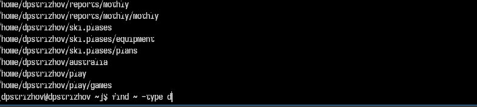{#fig:016 width=70%}

## Выводы

За время выполнения лабараторной работы я ознакомился с инструментами поиска файлов и фильтрации текстовых данных. Приобрел навыки: по управлению процессами (и заданиями), по
проверке использования диска и обслуживанию файловых систем.

## Список литературы{.unnumbered}
Лабараторная работа №8: https://esystem.rudn.ru/course/view.php?id=113

