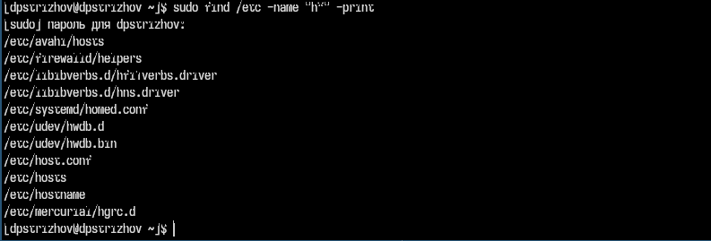

---
## Front matter
title: "Отчет по лабараторной работе №8"
subtitle: "Операционные системы"
author: "Дмитрий Павлович Стрижов"

## Generic otions
lang: ru-RU
toc-title: "Содержание"

## Bibliography
bibliography: bib/cite.bib
csl: pandoc/csl/gost-r-7-0-5-2008-numeric.csl

## Pdf output format
toc: true # Table of contents
toc-depth: 2
lof: true # List of figures
lot: true # List of tables
fontsize: 12pt
linestretch: 1.5
papersize: a4
documentclass: scrreprt
## I18n polyglossia
polyglossia-lang:
  name: russian
  options:
	- spelling=modern
	- babelshorthands=true
polyglossia-otherlangs:
  name: english
## I18n babel
babel-lang: russian
babel-otherlangs: english
## Fonts
mainfont: PT Serif
romanfont: PT Serif
sansfont: PT Sans
monofont: PT Mono
mainfontoptions: Ligatures=TeX
romanfontoptions: Ligatures=TeX
sansfontoptions: Ligatures=TeX,Scale=MatchLowercase
monofontoptions: Scale=MatchLowercase,Scale=0.9
## Biblatex
biblatex: true
biblio-style: "gost-numeric"
biblatexoptions:
  - parentracker=true
  - backend=biber
  - hyperref=auto
  - language=auto
  - autolang=other*
  - citestyle=gost-numeric
## Pandoc-crossref LaTeX customization
figureTitle: "Рис."
tableTitle: "Таблица"
listingTitle: "Листинг"
lolTitle: "Листинги"
## Misc options
indent: true
header-includes:
  - \usepackage{indentfirst}
  - \usepackage{float} # keep figures where there are in the text
  - \floatplacement{figure}{H} # keep figures where there are in the text
---

# Цель работы

Ознакомление с инструментами поиска файлов и фильтрации текстовых данных.
Приобретение практических навыков: по управлению процессами (и заданиями), по
проверке использования диска и обслуживанию файловых систем.

# Задание

1. Осуществите вход в систему, используя соответствующее имя пользователя.
2. Запишите в файл file.txt названия файлов, содержащихся в каталоге /etc. Допи-
шите в этот же файл названия файлов, содержащихся в вашем домашнем каталоге.
3. Выведите имена всех файлов из file.txt, имеющих расширение .conf, после чего
запишите их в новый текстовой файл conf.txt.
Кулябов Д. С. и др. Операционные системы 59
4. Определите, какие файлы в вашем домашнем каталоге имеют имена, начинавшиеся
с символа c? Предложите несколько вариантов, как это сделать.
5. Выведите на экран (по странично) имена файлов из каталога /etc, начинающиеся
с символа h.
6. Запустите в фоновом режиме процесс, который будет записывать в файл ~/logfile
файлы, имена которых начинаются с log.
7. Удалите файл ~/logfile.
8. Запустите из консоли в фоновом режиме редактор gedit.
9. Определите идентификатор процесса gedit, используя команду ps, конвейер и фильтр
grep. Как ещё можно определить идентификатор процесса?
10. Прочтите справку (man) команды kill, после чего используйте её для завершения
процесса gedit.
11. Выполните команды df и du, предварительно получив более подробную информацию
об этих командах, с помощью команды man.
12. Воспользовавшись справкой команды find, выведите имена всех директорий, имею-
щихся в вашем домашнем каталоге. 

# Выполнение лабораторной работы

Добавляем в файл file.txt названия всех файлов каталога /etc, а затем дописываем в этот файл названия файлов в домашнем каталоге (рис. [-@fig:001], [-@fig:002]).

{#fig:001 width=70%}

{#fig:002 width=70%}

Записываем все файлы из file.txt с conf в названии в файл conf.txt (рис. [-@fig:003]).

{#fig:003 width=70%}

Выводим все файлы домашнего каталога, у которых есть "с" в названии (рис. [-@fig:004],[-@fig:005]).

{#fig:004 width=70%}

{#fig:005 width=70%}

Выводим все файлы каталога с h в названии (рис. [-@fig:006]).

{#fig:006 width=70%}

Записываем в **фоновом режиме** в файл logfile все файлы домашнего каталога, содержищие в названии log (рис. [-@fig:007]).

{#fig:007 width=70%}

Удаляем полученный ранее файл (рис. [-@fig:008]).

{#fig:008 width=70%}

Запускаем текстовый редактор в фоновом режиме (рис. [-@fig:009]).

{#fig:009 width=70%}

Определяем идентификатор процесса, запущенного ранее (рис. [-@fig:010]).

{#fig:010 width=70%}

Узнаем больше о команде kill и прерываем процесс gedit с помощью идентификатора (рис. [-@fig:011]).

{#fig:011 width=70%}

Узнаем больше о командах df, du и выполняем их (рис. [-@fig:012], [-@fig:013], [-@fig:014]).

{#fig:012 width=70%}

{#fig:013 width=70%}

{#fig:014 width=70%}

С помощью man узнаем как, используя find, вывести каталоги домашнего каталога (рис. [-@fig:015], [-@fig:016]).

{#fig:015 width=70%}

{#fig:016 width=70%}

# Выводы

За время выполнения лабараторной работы я ознакомился с инструментами поиска файлов и фильтрации текстовых данных. Приобрел навыки: по управлению процессами (и заданиями), по
проверке использования диска и обслуживанию файловых систем.

# Список литературы{.unnumbered}
Лабараторная работа №8: https://esystem.rudn.ru/course/view.php?id=113
::: {#refs}
:::
