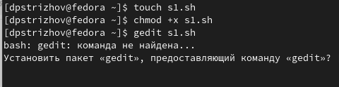
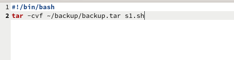
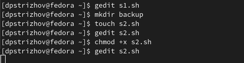
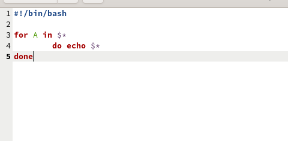
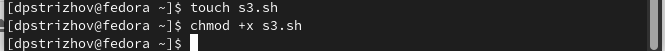
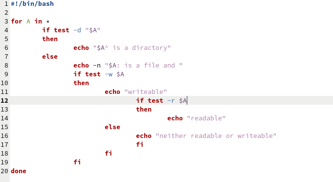
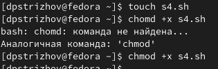
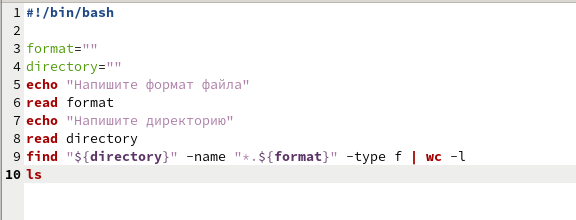

---
## Front matter
lang: ru-RU
title: Отчет по лабораторной работе №12
subtitle: Операционные системы
author:
  - Стрижов Д. П.
institute:
  - Российский университет дружбы народов, Москва, Россия
date: 27 апреля 2024

## i18n babel
babel-lang: russian
babel-otherlangs: english
## Fonts
mainfont: PT Serif
romanfont: PT Serif
sansfont: PT Sans
monofont: PT Mono
mainfontoptions: Ligatures=TeX
romanfontoptions: Ligatures=TeX
sansfontoptions: Ligatures=TeX,Scale=MatchLowercase
monofontoptions: Scale=MatchLowercase,Scale=0.9
## Formatting pdf
toc: false
toc-title: Содержание
slide_level: 2
aspectratio: 169
section-titles: true
theme: metropolis
header-includes:
 - \metroset{progressbar=frametitle,sectionpage=progressbar,numbering=fraction}
 - '\makeatletter'
 - '\beamer@ignorenonframefalse'
 - '\makeatother'
---

## Цели и задачи

Изучить основы программирования в оболочке ОС UNIX/Linux. Научиться писать
небольшие командные файлы.

1. Написать скрипт, который при запуске будет делать резервную копию самого себя (то
есть файла, в котором содержится его исходный код) в другую директорию backup
в вашем домашнем каталоге. При этом файл должен архивироваться одним из архиваторов на выбор zip, bzip2 или tar. Способ использования команд архивации
необходимо узнать, изучив справку.
2. Написать пример командного файла, обрабатывающего любое произвольное число
аргументов командной строки, в том числе превышающее десять. Например, скрипт
может последовательно распечатывать значения всех переданных аргументов.
3. Написать командный файл — аналог команды ls (без использования самой этой команды и команды dir). Требуется, чтобы он выдавал информацию о нужном каталоге
и выводил информацию о возможностях доступа к файлам этого каталога.
4. Написать командный файл, который получает в качестве аргумента командной строки
формат файла (.txt, .doc, .jpg, .pdf и т.д.) и вычисляет количество таких файлов
в указанной директории. Путь к директории также передаётся в виде аргумента командной строки.

# Выполнение лабораторной работы

## Создаю файл s1.sh, дай ему доступ для выполнения, чтобы можно было его запускать без ключевого слова bash 

{#fig:001 width=70%}

## Прописываю команду для создания резервного файла в каталоге backup, при этом копия архивируется 

{#fig:002 width=70%}

## Создаю файл s2.sh, дай ему доступ для выполнения, чтобы можно было его запускать без ключевого слова bash 

{#fig:003 width=70%}

## Прописываю скрипт, который выводит произвольное количество переменных 

{#fig:004 width=70%}

## Создаю файл s3.sh, дай ему доступ для выполнения, чтобы можно было его запускать без ключевого слова bash 

{#fig:005 width=70%}

## Прописываю скрипт, который является аналогом ls 

{#fig:006 width=70%}

## Создаю файл s4.sh, дай ему доступ для выполнения, чтобы можно было его запускать без ключевого слова bash 

{#fig:007 width=70%}

## Прописываю скрипт, который вычисляет количество файлов определенного формата в определенной директории 

{#fig:008 width=70%}

## Выводы

За время выполнения лабораторной работы я изучил основы программирования в оболочке ОС UNIX/Linux. Научился писать небольшие командные файлы.  

## Список литературы

Лабораторная работа №12: https://esystem.rudn.ru/course/view.php?id=113
