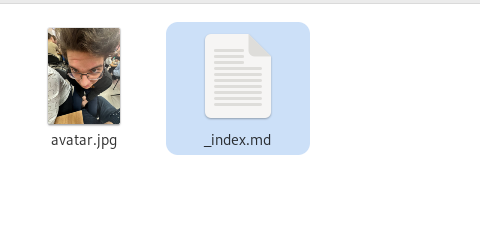
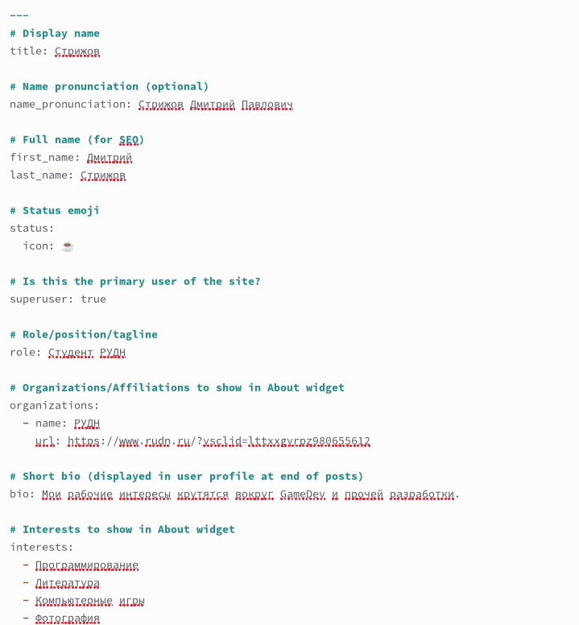
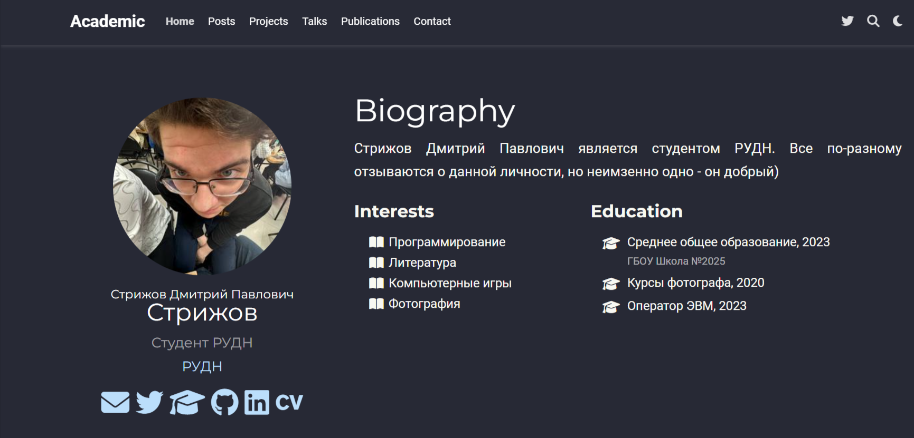
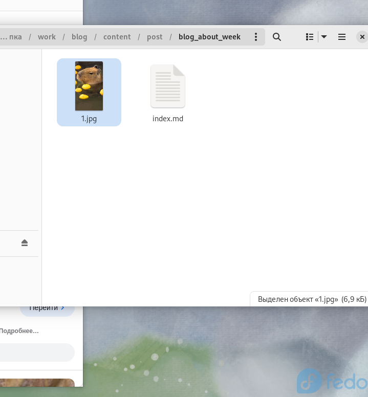
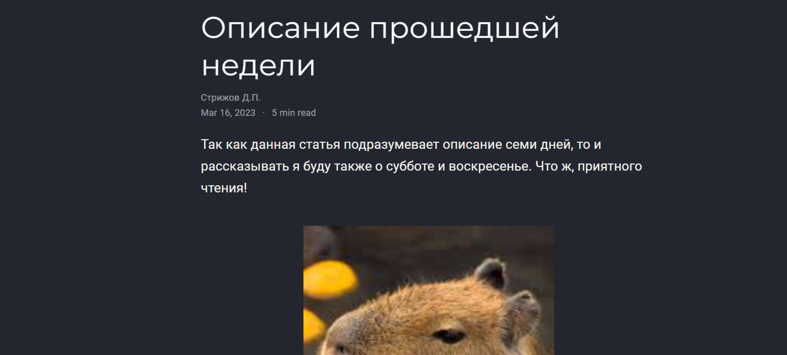
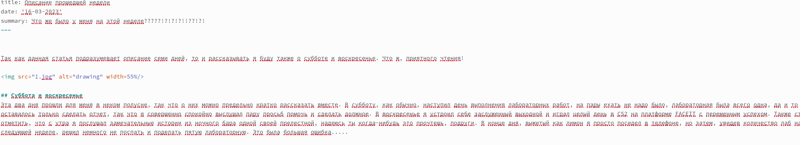
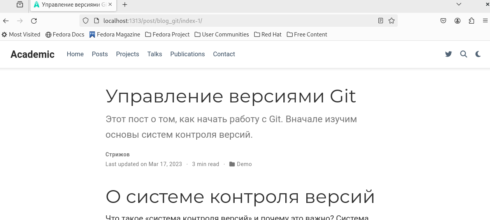

---
## Front matter
title: "Шаблон отчёта по лабораторной работе"
subtitle: "Простейший вариант"
author: "Дмитрий Сергеевич Кулябов"

## Generic otions
lang: ru-RU
toc-title: "Содержание"

## Bibliography
bibliography: bib/cite.bib
csl: pandoc/csl/gost-r-7-0-5-2008-numeric.csl

## Pdf output format
toc: true # Table of contents
toc-depth: 2
lof: true # List of figures
lot: true # List of tables
fontsize: 12pt
linestretch: 1.5
papersize: a4
documentclass: scrreprt
## I18n polyglossia
polyglossia-lang:
  name: russian
  options:
	- spelling=modern
	- babelshorthands=true
polyglossia-otherlangs:
  name: english
## I18n babel
babel-lang: russian
babel-otherlangs: english
## Fonts
mainfont: PT Serif
romanfont: PT Serif
sansfont: PT Sans
monofont: PT Mono
mainfontoptions: Ligatures=TeX
romanfontoptions: Ligatures=TeX
sansfontoptions: Ligatures=TeX,Scale=MatchLowercase
monofontoptions: Scale=MatchLowercase,Scale=0.9
## Biblatex
biblatex: true
biblio-style: "gost-numeric"
biblatexoptions:
  - parentracker=true
  - backend=biber
  - hyperref=auto
  - language=auto
  - autolang=other*
  - citestyle=gost-numeric
## Pandoc-crossref LaTeX customization
figureTitle: "Рис."
tableTitle: "Таблица"
listingTitle: "Листинг"
lofTitle: "Список иллюстраций"
lotTitle: "Список таблиц"
lolTitle: "Листинги"
## Misc options
indent: true
header-includes:
  - \usepackage{indentfirst}
  - \usepackage{float} # keep figures where there are in the text
  - \floatplacement{figure}{H} # keep figures where there are in the text
---

# Задание

1. Разместить фотографию владельца сайта.
2. Разместить краткое описание владельца сайта (Biography).
3. Добавить информацию об интересах (Interests).
4. Добавить информацию от образовании (Education).
5. Сделать пост по прошедшей неделе.
6. Добавить пост на тему по выбору.
        

# Выполнение индивидуального проекта

Добавляем фото автора (рис. [-@fig:001]).

{#fig:001 width=70%}

Меняем биографию интересы и прочие параметры (рис. [-@fig:002]).

{#fig:002 width=70%}

Вот полученный результат (рис. [-@fig:003]).

{#fig:003 width=70%}

Создаем первый пост (рис. [-@fig:004]).

{#fig:004 width=70%}

Создаем первый пост (рис. [-@fig:005]).

{#fig:005 width=70%}

То, что храниться внутри первого поста(рис. [-@fig:006]).

{#fig:006 width=70%}

Второй пост (рис. [-@fig:007]).

{#fig:007 width=70%}

# Выводы

Выполнен второй этап индивидуального проекта. 

