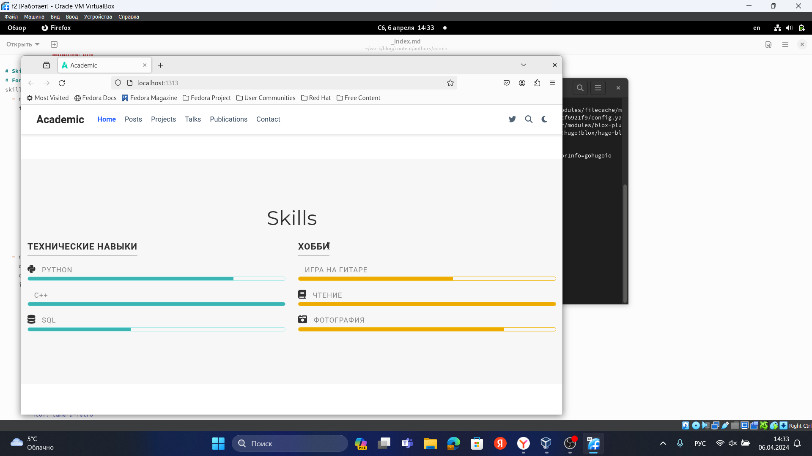

---
## Front matter
lang: ru-RU
title: Структура научной презентации
subtitle: Простейший шаблон
author:
  - Кулябов Д. С.
institute:
  - Российский университет дружбы народов, Москва, Россия
  - Объединённый институт ядерных исследований, Дубна, Россия
date: 01 января 1970

## i18n babel
babel-lang: russian
babel-otherlangs: english
## Fonts
mainfont: PT Serif
romanfont: PT Serif
sansfont: PT Sans
monofont: PT Mono
mainfontoptions: Ligatures=TeX
romanfontoptions: Ligatures=TeX
sansfontoptions: Ligatures=TeX,Scale=MatchLowercase
monofontoptions: Scale=MatchLowercase,Scale=0.9

## Formatting pdf
toc: false
toc-title: Содержание
slide_level: 2
aspectratio: 169
section-titles: true
theme: metropolis
header-includes:
 - \metroset{progressbar=frametitle,sectionpage=progressbar,numbering=fraction}
 - '\makeatletter'
 - '\beamer@ignorenonframefalse'
 - '\makeatother'
---

## Задание

1. Разместить фотографию владельца сайта.
2. Разместить краткое описание владельца сайта (Biography).
3. Добавить информацию об интересах (Interests).
4. Добавить информацию от образовании (Education).
5. Сделать пост по прошедшей неделе.
6. Добавить пост на тему по выбору.
        

# Выполнение индивидуального проекта

## Добавляем фото автора 

{#fig:001 width=70%}

## Меняем биографию интересы и прочие параметры 

{#fig:002 width=70%}

## Вот полученный результат 

{#fig:003 width=70%}

## Создаем первый пост 

{#fig:004 width=70%}

## Создаем первый пост 

{#fig:005 width=70%}

## То, что храниться внутри первого поста

{#fig:006 width=70%}

## Второй пост

{#fig:007 width=70%}

## Выводы

Выполнен второй этап индивидуального проекта. 

