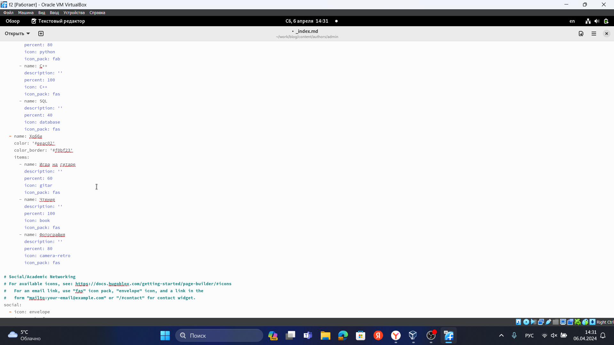
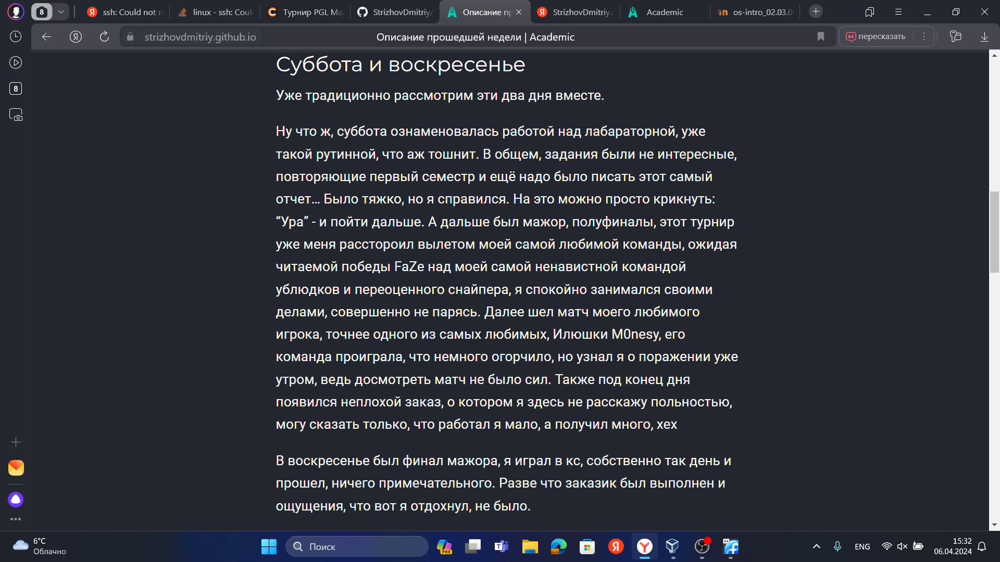

---
## Front matter
lang: ru-RU
title: Структура презентации с приколами
subtitle: Простейший шаблон очередного типичного отчета, которые я уже не могу делать
author:
  - Стрижов Д.П.
institute:
  - Российский университет дружбы народов, Москва, Россия
date: 06 апреля 2024

## i18n babel
babel-lang: russian
babel-otherlangs: english
## Fonts
mainfont: PT Serif
romanfont: PT Serif
sansfont: PT Sans
monofont: PT Mono
mainfontoptions: Ligatures=TeX
romanfontoptions: Ligatures=TeX
sansfontoptions: Ligatures=TeX,Scale=MatchLowercase
monofontoptions: Scale=MatchLowercase,Scale=0.9
## Formatting pdf
toc: false
toc-title: Содержание
slide_level: 2
aspectratio: 169
section-titles: true
theme: metropolis
header-includes:
 - \metroset{progressbar=frametitle,sectionpage=progressbar,numbering=fraction}
 - '\makeatletter'
 - '\beamer@ignorenonframefalse'
 - '\makeatother'
---

## Цель работы

Добавить к сайту достижения.

## Задание

1. Список достижений.
   Добавить информацию о навыках (Skills).
   Добавить информацию об опыте (Experience).
   Добавить информацию о достижениях (Accomplishments).
2. Сделать пост по прошедшей неделе.
  

# Выполнение лабораторной работы

## Добавляем информацию о навыках, об опыте и о достижениях 

{#fig:001 width=70%}

## Проверяем результат

{#fig:002 width=70%}

## Пишем пост о прошедшей неделе 

{#fig:003 width=70%}

## Выводы

За время выполнения этапа индивидуального проекта я добавил на сайт достижения.

