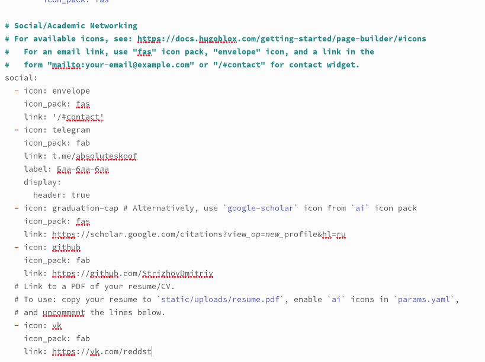
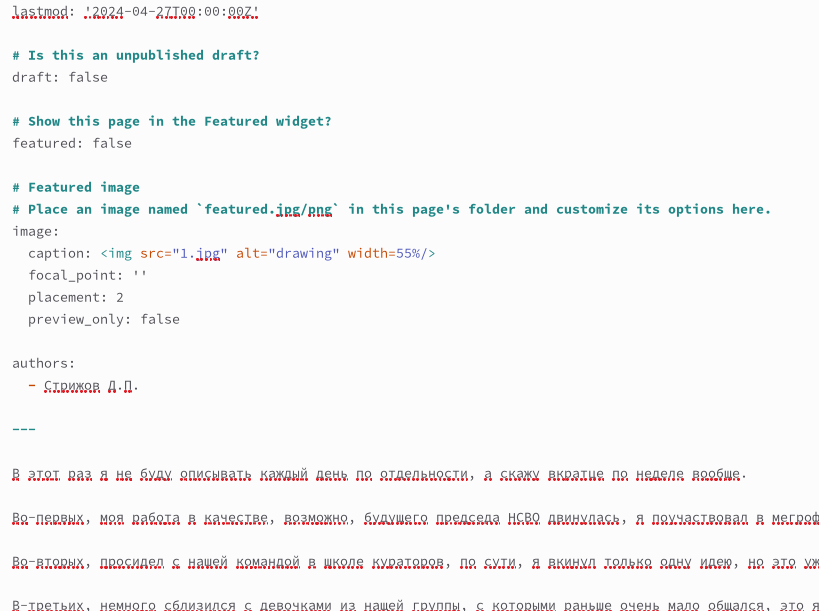

---
## Front matter
lang: ru-RU
title: Отчет по этапу проекта №4
subtitle: Операционные системы 
author:
  - Стрижов Д. П.
institute:
  - Российский университет дружбы народов, Москва, Россия
date: 27 апреля 2024

## i18n babel
babel-lang: russian
babel-otherlangs: english
## Fonts
mainfont: PT Serif
romanfont: PT Serif
sansfont: PT Sans
monofont: PT Mono
mainfontoptions: Ligatures=TeX
romanfontoptions: Ligatures=TeX
sansfontoptions: Ligatures=TeX,Scale=MatchLowercase
monofontoptions: Scale=MatchLowercase,Scale=0.9
## Formatting pdf
toc: false
toc-title: Содержание
slide_level: 2
aspectratio: 169
section-titles: true
theme: metropolis
header-includes:
 - \metroset{progressbar=frametitle,sectionpage=progressbar,numbering=fraction}
 - '\makeatletter'
 - '\beamer@ignorenonframefalse'
 - '\makeatother'
---

## Цель работы

Создать сайт найчного рабтника

## Задание

Добавить необходимые ссылки 

# Выполнение лабораторной работы

## Добавил все нужные ссылки 

{#fig:001 width=70%}

## Добавил все нужные ссылки 

{#fig:002 width=71%}

## Написал пост о прошедшей неделе 

{#fig:003 width=71%}

## Выводы
Были добавлены ссылки на мои соц.сети

